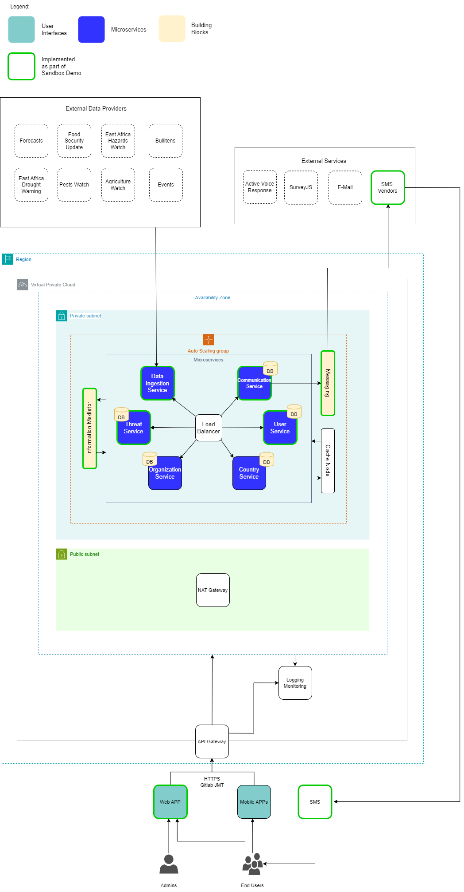

# Early Warning - Tech Demo

The demo of a early warning system focuses on efficient communication between civil servants and communities in a given region. The system enables civil servants to validate raw threat information and create broadcasts to inform communities about potential hazards, while collecting structured feedback from recipients.


Acknowledgement: This use case has been developed in cooperation with the _IGAD Climate Prediction & Applications Centre_


## Which GovStack <mark style="background-color:blue;">features are demonstrated</mark>?

With this use case implementation, we demonstrate the GovStack approach through...


**Modular and scalable architecture**

A-synchronous data exchange between micro services / Building Block enables future scaling to additional messaging channels, sectors and recipients. See architecture diagram below.



**Integration of Building Blocks Software**

For this demo, we chose the following software applications (does not imply a recommendation):

* BB Messaging: RapidPro (for bi-directional communication)
* BB Information Mediator (Pub/Sub): Kafka
* BB Registry: PostgreSQL



**Backend Visualization**

As core features of the demo are hidden in the backend, we implemented a side bar visualizing the handling of broadcasts by micro services and Building Blocks.


## How to <mark style="background-color:blue;">access</mark>?

**Data Privacy Note:** By clicking on one of the access points you enter web applications operated by the Deutsche Gesellschaft für Internationale Zusammenarbeit (GIZ) GmbH where these Data Protection Notice and Registration Information are valid.

<table data-view="cards"><thead><tr><th></th><th></th><th></th><th data-hidden data-card-target data-type="content-ref"></th><th data-hidden data-card-cover data-type="files"></th></tr></thead><tbody><tr><td><strong>Early Warning System</strong></td><td>Create and broadcast SMS messages</td><td></td><td><a href="https://early-warnings.playground.sandbox-playground.com/">https://early-warnings.playground.sandbox-playground.com/</a></td><td><a href="../../.gitbook/assets/GSEarlyWarning.png">GSEarlyWarning.png</a></td></tr></tbody></table>

Email: `firstUser@test.com`

Password: `asdf1234`

Check marking "I accept the Terms and Conditions" is technically necessary but has no legal implication.

## How to <mark style="background-color:blue;">navigate</mark> through the demo?

**Threat:** Raw information regarding a warning or potential hazard. This is what admins (civil servants) see and use to create broadcasts.&#x20;

**Broadcast:** Information that is shared with a group of end-users. These are created based on threats and distributed to affected people.

**Feedbacks:** Messages received in response to broadcasts or about ongoing situations.



### Log-in

Authentication is done with a simple mock-up (no _Identity BB_)



### Watch current and past threats and broadcasts

Threats have been ingested from external sources (e.g. hazard watch). Both threats and broadcasts are stored in databases representing the _Registry BB_.



### Draft a broadcast

Based on a threat, a broadcast is created and title, languages, content, channel, recipients are added by the admin.



### Sent a broadcast

The submitted broadcast will be sent to the _Information Mediator BB_ (PubSub). From there, the communication service add recpient data and sents the complete broadcast to the _Messaging BB_ to be sent to a SMS service provider.



### Receive feedback by recipients (deactivated)

The Messaging Building Block receives a response, gives a label and saves the response. In this demo, this functionality is deactivated.



## How are the stack components <mark style="background-color:blue;">assembled</mark>?

The following diagram shows one use case instance with used applications and Building Blocks.

<figure><figcaption></figcaption></figure>

The following diagram shows the BPM of the core process: Using threat information to issue a broadcast.

<figure><figcaption></figcaption></figure>

You can find the open source code and helm charts for deployment in the following repositories:

[Thread Service - GitHub Repository](https://github.com/GovStackWorkingGroup/sandbox-usecase-earlywarning-threatservice)

[Frontend - GitHub Repository](https://github.com/GovStackWorkingGroup/sandbox-usecase-earlywarning-frontend)

[Log Service - GitHub Repository](https://github.com/GovStackWorkingGroup/sandbox-usecase-earlywarning-frontend)

[Data Ingestion Service - GitHub Repository](https://github.com/GovStackWorkingGroup/sandbox-usecase-earlywarning-dataingestionservice)

[Communication Service - GitHub Repository](https://github.com/GovStackWorkingGroup/sandbox-usecase-earlywarning-communicationservice)

[User Service - GitHub Repository](https://github.com/GovStackWorkingGroup/sandbox-usecase-earlywarning-userservice)

## Data Protection Notice and Registration Information

The following information are valid for all web applications linked in the access points chapter.

Data Protection Notice

The Deutsche Gesellschaft für Internationale Zusammenarbeit (GIZ) GmbH attaches great importance to responsible and transparent management of personal data.

Below we provide users with information as to

* who they can contact at GIZ on the subject of data protection
* what data is processed when they visit the web application
* what rights they have with respect to us

**Controller and Data Protection Officer**

The responsible body for data processing is the Deutsche Gesellschaft für Internationale Zusammenarbeit (GIZ) GmbH.

Address:\
Friedrich-Ebert-Allee 32 + 36, 53113 Bonn\
Dag-Hammarskjöld-Weg 1–5, 65760 Eschborn

Contact:\
nico.lueck@giz.de

If you have specific questions about the protection of your data, please contact GIZ's data protection officer: datenschutzbeauftragte@giz.de

**General**

GIZ processes personal data exclusively in accordance with the [EU General Data Protection Regulation (GDPR)](https://eur-lex.europa.eu/legal-content/DE/TXT/PDF/?uri=CELEX:32016R0679\&qid=1527147390147\&from=EN) and the [German Federal Data Protection Act (Bundesdatenschutzgesetz, BDSG)](http://www.gesetze-im-internet.de/bdsg_2018/index.html).\
Personal data are, for example, name, address, email addresses and user behaviour.

GIZ only processes personal data to the extent necessary. Which data is required and processed for which purpose and on what basis is largely determined by the type of service you use or the purpose for which the data is required.

**Cookies**

When you visit a web application, small text files, so-called cookies, are stored on your computer. They are used to make the online presence more user-friendly and effective overall Cookies cannot run programs or infect your computer with viruses.

The GIZ website uses cookies that are automatically deleted as soon as the browser in which the page is displayed is closed (so-called temporary cookies or session cookies). This type of cookie makes it possible to assign different requests from a browser to a session and to recognize the browser when you visit the website again (session ID).

**Collection of personal data when visiting a web application**

When visiting a [web application](./#access-points), GIZ itself processes only the data that is automatically transmitted by the browser and technically required in order to display the website correctly and to ensure its stability and security. Each time a web application is accessed, the data stored includes, but is not limited to the following:

* Date (The date on which the activity occurred.)
* Time (The time, in coordinated universal time (UTC), at which the activity occurred.)
* Server IP Address (The IP address of the server on which the log file entry was generated.)
* Method (The requested action, for example, a GET method.)
* URI Stem (The target of the action, for example, Default.htm.)
* URI Query (The query, if any that the client was trying to perform. A Universal Resource Identifier (URI) query is necessary only for dynamic pages.)
* Server Port (The server port number that is configured for the service.)
* Client IP Address (The IP address of the client that made the request.)
* User Agent (The browser type that the client used.)
* Referrer (The site that the user last visited. This site provided a link to the current site.)
* HTTP Status (The HTTP status code.)
* Time Taken (The length of time that the action took, in milliseconds.)
* Request Body (The transmitted data for demonstration purposes (e.g. fictional person)

The data in the log file is temporary stored. The log retention time depend on amount of requests, service up time and other factors.

**Further information on the storage and transfer of data:**

GIZ is obliged to store data beyond the time of the visit in order to ensure protection against attacks on the GIZ’s internet infrastructure and the communications technology of the Federal Government (legal basis: Art. 6 (1) (e) GDPR in conjunction with Section 5 BSI Act). In the event of attacks on communications technology, this data is analyzed and used to initiate legal and criminal prosecution.

Data logged when accessing the GIZ's web applications is only transmitted to third parties if there is a legal obligation to do so or if the transmission is necessary for legal or criminal prosecution in the event of attacks on the Federal Government's communications technology. Data will not be passed on in any other cases. This data is not merged with other data sources at GIZ.

**Information on opting out**

Users who do not agree with the described processing of data cannot access the web applications. For technical reasons, opting out is not possible.

**Disclosure to third parties**

GIZ does not pass on personal data to third parties unless it is legally obliged or entitled to do so by law.

**Transfer of data to countries outside Germany**

GIZ does not transfer personal data to third countries. When using social media, the privacy policies of the respective providers apply.

**Duration of data retention**

User data will not be kept any longer than is necessary for the purpose for which it is processed or as required by law.

**IT security of user data**

GIZ accords great importance to protecting personal data. For this reason, technical and organisational security measures ensure that data is protected against accidental and intentional manipulation and unintended erasure as well as unauthorised access. These measures are updated accordingly based on technical developments and adapted continuously in line with the risks.

Visitors to the GIZ website have the right

* To obtain **information** about their data stored by us (Article 15 GDPR)
* To have their data stored by us **rectified** (Article 16 GDPR)
* To have their data stored by us **erased** (Article 17 GDPR)
* To obtain **restriction** of processing of their data stored by us (Article 18 GDPR)
* To **object** to the storage of their data if personal data are processed on the basis of the first sentence of Article 6 (1) 1 f and e GDPR (Article 21 GDPR)
* To receive their personal data in a commonly used and machine-readable format from the controller such that they can be potentially transmitted to another controller (right to **data portability**, Article 20 GDPR).
* To **withdraw** their consent to the extent that the data has been processed on the basis of consent (Article 6 (1) a GDPR). The lawfulness of the processing on the basis of the consent given remains unaffected until receipt of the withdrawal.

Users also have the right in accordance with Article 77 GDPR to **lodge a complaint with the competent data protection supervisory authority**. The competent authority is the Federal Commissioner for Data Protection and Freedom of Information ([BfDI](https://www.bfdi.bund.de/EN/Home/home_node.html)).

Registration Information

Deutsche Gesellschaft für Internationale Zusammenarbeit (GIZ) GmbH

**Registered offices**

Bonn and Eschborn\
Germany

Friedrich-Ebert-Allee 32 + 36\
53113 Bonn\
Germany\
T +49 228 44 60-0\
F +49 228 44 60-17 66

Dag-Hammarskjöld-Weg 1 - 5\
65760 Eschborn\
Germany\
T +49 61 96 79-0\
F +49 61 96 79-11 15

E info@giz.de\
I www.giz.de

**Registered at**

Local court (Amtsgericht) Bonn, Germany: HRB 18384\
Local court (Amtsgericht) Frankfurt am Main, Germany: HRB 12394

**VAT no.**

DE 113891176

**Chairperson of the Supervisory Board**

Jochen Flasbarth, State Secretary in the Federal Ministry for Economic Cooperation and Development

**Management Board**

Thorsten Schäfer-Gümbel (Chair)\
Ingrid-Gabriela Hoven (Vice-Chair)\
Anna Sophie Herken

