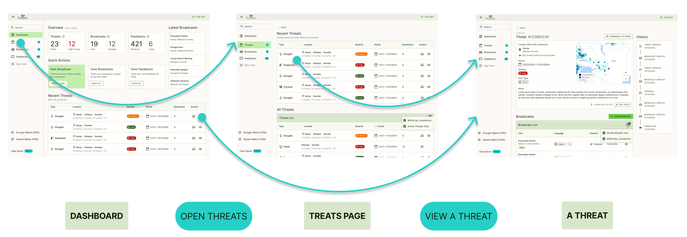
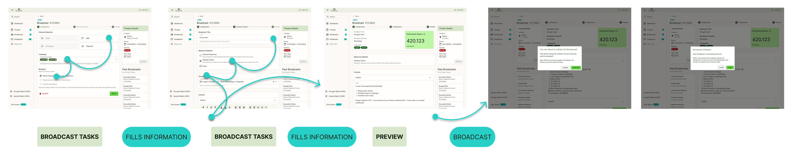
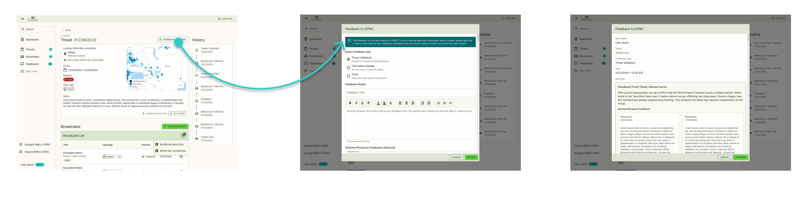
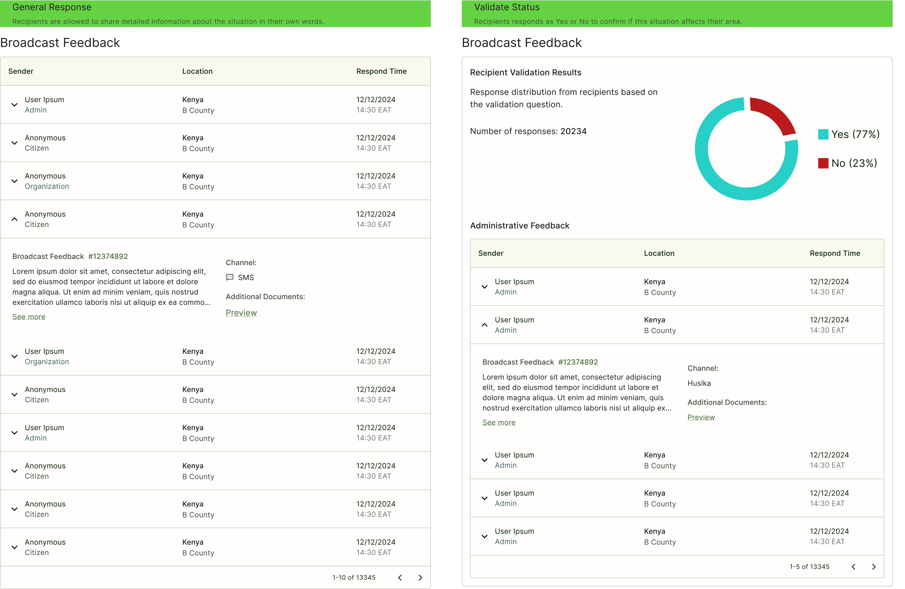
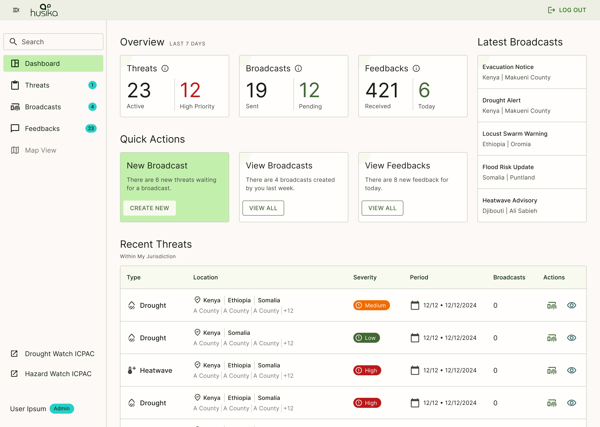
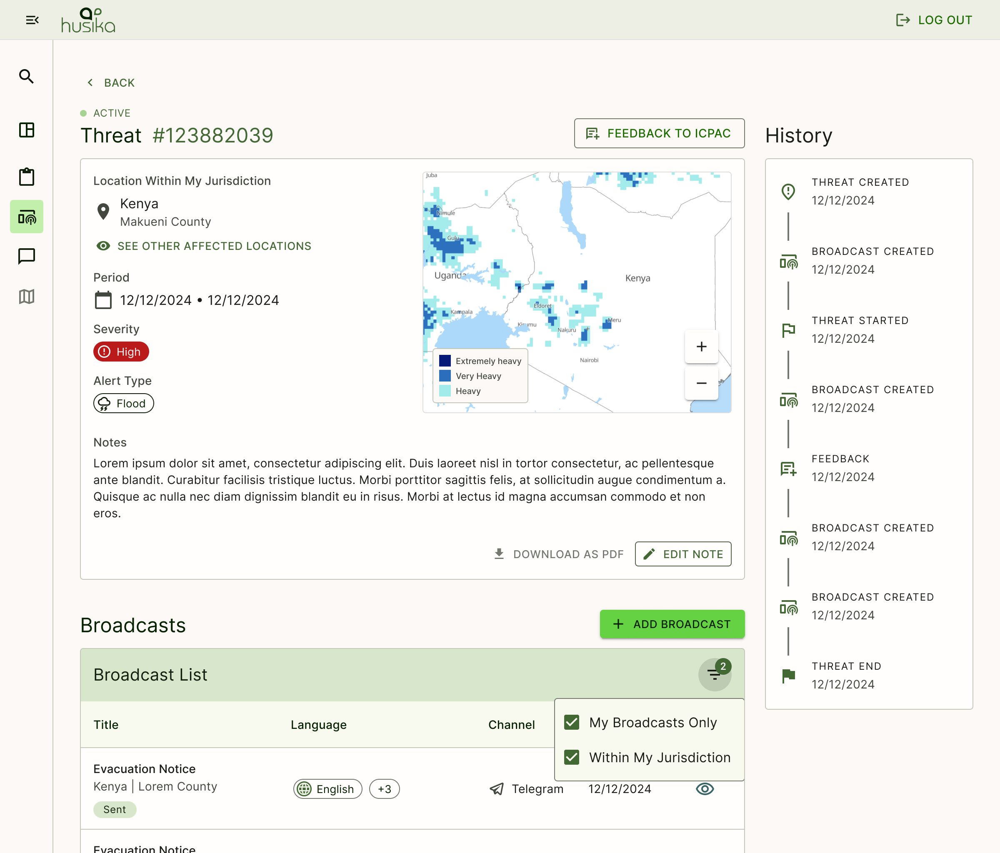
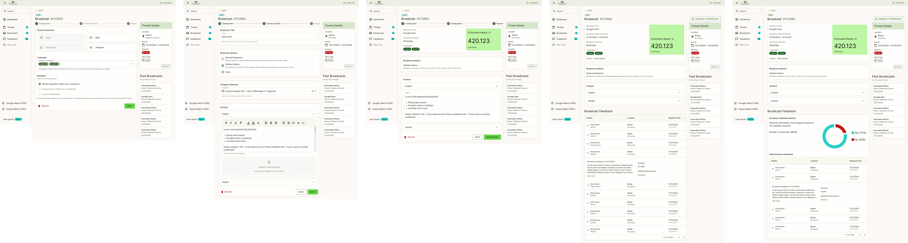
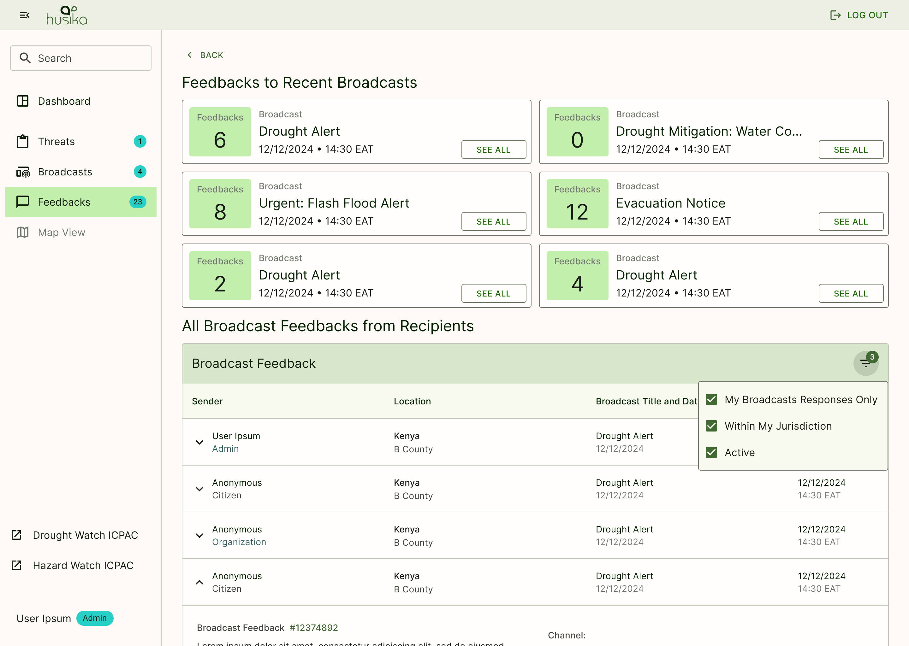

# Project Documentation

## **Project Context**

### **Core Objectives**

1. Enable civil servants to monitor threats effectively
2. Facilitate clear communication about potential hazards
3. Collect and organize community responses
4. Support multi-language broadcasts

### **Key Functionalities**

1. Threat monitoring and validation
2. Structured broadcast creation
3. Response collection
4. Jurisdiction-based access control

### Methodology 

With limited time and resources, our approach focused on quickly capturing essential functionalities and user needs, using an agile, iterative workflow.

Essential steps of GovStack methodology had to be skipped for this demo application due to resource and time constraints, i.e. As-Is User Journey, To-Be User Journey and Service Blueprint. What we managed to accomplish during research and design phase:

#### Market Research 

To further inform our design decisions and contextualize our project within the broader industry landscape, we conducted a quick market analysis of multi-hazard early warning systems. This research provided valuable insights into current best practices, user expectations, and feature sets in similar solutions, which helped shape our approach.

#### Direct BPMN Model Creation 

We initiated the project by developing a Business Process Model and Notation (BPMN) model to map out the system's core workflows. This decision stemmed from our need to quickly visualize the structure of the system, given the time constraints. Our BPMN model was based on initial customer meetings, assumptions, and available documents. Since we couldn't access the existing system directly, we leveraged screenshots from their presentations to understand the current flow and identify gaps.

#### Wireframe Development and Ideation 

After establishing the BPMN model, we transitioned to the ideation phase to create initial wireframes. Throughout this phase, we worked closely with the development team to verify that our design ideas aligned with technical constraints and current capabilities. This frequent communication allowed us to iterate rapidly, ensuring that our designs were both practical and aligned with the project's technical requirements.

#### Prototype Creation and Iteration 

After refining our wireframes based on feedback from stakeholders and technical input, we developed the first prototype. This prototype embodied the initial assumptions and evolved requirements, serving as the foundation for further testing and validation.

## Key Decisions

### Decision 1: Use of MUI (Material-UI) for Component Library 

#### Context and Challenge 

[MUI: The React component library you always wanted](https://mui.com/)

Given the project's tight timeline, we needed to streamline the design and development process as much as possible. Although a custom component library would allow for more tailored, case-specific design solutions, building this from scratch would require extensive time and resources.

#### Solution and Rationale 

To expedite the design process without compromising functionality, we decided to use MUI (Material-UI) as our component library. MUI offers ready-made set of components that adhere to industry-standard Material Design principles. This choice provided a balance between speed and design quality, allowing us to focus more on flow and usability rather than component creation.

#### Impact on Flow and Users 

Using MUI significantly reduced development time and ensured consistency in the UI. While custom components would offer greater design specificity, MUI allowed us to achieve a professional and polished interface that meets general user experience standards. This decision, however, may require customization or future adjustments to better align with case-specific needs as the project matures.

### Decision 2: Limiting User Layers for Prototype 

#### Context and Challenge 

The original system had multiple user roles and complex hierarchies. For the prototype, we needed to simplify the user structure while maintaining core functionality.

#### Solution and Rationale 

We limited the system to two primary user types:

* Administrators (civil servants managing the system and working based on the jurisdiction)
* Recipients (people receiving broadcast messages)\
  This simplified approach allows us to focus on core functionalities and user flows without getting caught in complex role management. In addition, due to lack of documentation regarding various role this approach would be optimum solution within our limited time.

#### Impact on Flow and Users 

This decision dramatically simplified the user experience and development process, allowing us to focus on the core interactions between administrators and recipients. While this may need expansion in future versions, it provides a solid foundation for testing and validating the main system concepts.

### Decision 3: User Flow 

#### Context and Challenge 

Starting from scratch, we needed to create intuitive user flows that would make complex emergency communication processes manageable and effective.

#### Solution and Rationale 

We developed a streamlined flow focusing on two main areas:

* Threat monitoring and validation
* Broadcast creation and distribution while collecting responses\
  Each area was designed with clear steps and logical progression, minimizing confusion and user error.

#### Impact on Flow and Users 

The flow provides a clear path for users to follow, making complex tasks more manageable. It reduces cognitive load while ensuring all necessary steps are completed in the right order.

### Decision 4: Terminology 

#### Context and Challenge 

Clear communication required consistent, understandable terminology that accurately reflected system functions while avoiding confusion.

#### Solution and Rationale 

We developed a simplified terminology framework. These terms were chosen for clarity and directness, avoiding technical jargon. We avoided using terms like "alert" or "warning" as imported data do not automatically imply need for actions - the data indicate potential risks = threats.

* "Threats" for potential hazards being monitored
  * **Threat:** Raw information regarding a warning or potential hazard. This is what admins (civil servants) see and use to create broadcasts.&#x20;
* "Broadcasts" for communications sent to recipients
  * **Broadcast:** Information that is shared with a group of end-users. These are created based on threats and distributed to affected people.
* "Feedbacks" for responses
  * **Feedbacks:** Messages received in response to broadcasts or about ongoing situations. We have two primary different Feedback.
    * Feedback to data provider: which is mainly responses conducted for validation purposes towards threat.
    * Feedback to Broadcast: which is responses that is collected through the broadcast.

#### Impact on Flow and Users 

Consistent terminology helps users quickly understand system functions and reduces confusion. It provides a common language for all users while maintaining professional standards. Used terminologies should be clearly documented also for the future.

### Decision 5: Quantitative and Qualitative Feedback Collection System 

#### Context and Challenge 

The system needed to collect both structured and unstructured feedback from recipients of broadcasts. We needed a way to gather quantifiable data for quick analysis and validations while also allowing for detailed, contextual information from the community.

#### Solution and Rationale 

We implemented a two-tier response system:

1. Validate Status: Simple Yes/No responses for quick, quantifiable feedback
2. General Response: Open-text format for detailed information\
   This approach allows for both statistical analysis and rich, contextual feedback while keeping the response mechanism simple for end-users.

#### Impact on Flow and Users 

This decision simplified data collection and analysis while maintaining flexibility in feedback gathering. The validate status option provides immediate, measurable insights, while the general response option allows for more detailed community input when needed.

### Decision 6: Jurisdiction-Based Access Control 

#### Context and Challenge 

Users needed to see threats across multiple locations for better situational awareness, but broadcast capabilities needed to be restricted to appropriate jurisdictional areas to maintain proper authority structures and prevent unauthorized communications.

#### Solution and Rationale 

We implemented a hybrid approach where:

* Threats are visible across multiple locations
* Broadcast capabilities are restricted to user's jurisdiction
* Clear indication of jurisdictional limitations in the interface\
  This balanced the need for widespread threat awareness with controlled communication channels.

#### Impact on Flow and Users 

This approach provides users with comprehensive threat visibility while maintaining appropriate control over broadcast creation. The clear distinction between viewing and action capabilities helps users understand their roles and responsibilities within the system.

### Decision 7: Template-Based Broadcast Creation 

#### Context and Challenge 

Creating effective emergency communications requires consistency in messaging while allowing for situation-specific details. We needed to balance standardization with flexibility in broadcast creation.

#### Solution and Rationale 

We implemented a template system for broadcasts that:

* Provides pre-structured formats
* Allows for customization
* Supports multiple languages
* Includes specific response collection options\
  This approach ensures consistency in communication while maintaining flexibility for different situations.

#### Impact on Flow and Users 

Templates streamline the broadcast creation process while ensuring important information isn't overlooked. This makes the system more efficient for civil servants while maintaining message quality and effectiveness.

## Service Design

### BPM



<figure><figcaption></figcaption></figure>

### Flow & Key Functionalities 

This section outlines the core user flows and key functional capabilities of the Husika early warning system, as envisioned in the Figma design mockups.

The system is designed to support three primary user flows:

1. Threat Monitoring
2. Broadcasting
3. Feedback Collection

These flows are supported by a set of integrated features and an information architecture that enables users to effectively manage threats, communicate with stakeholders, and collect valuable feedback.

All following designs and frames can also be found on FIGMA:



### Core User Flows 

The three core user flows are described in detail below, based on the Figma designs:

#### Threat Monitoring 

**Design:**

* The Threat Monitoring functionality is accessible from multiple entry points in the system:
  * The Dashboard provides an overview of active and high-priority threats, which users can click through to access the full Threats view.
  * The Threats page serves as the central hub for monitoring and managing threats, offering a comprehensive tabular listing.
* On the Threats page, users can view all threats across their jurisdiction but also other areas too, Users can see:
  * The threats list based on criteria such as threat status, location, severity, and more.
  * Quickly identify high-priority threats through visual cues like color-coded severity indicators.
* The threats table includes the location information for each threat, displayed with an icon to indicate whether the threat is within the user's jurisdiction or outside of it.
* Clicking on a specific threat in the Threats list opens the Threat Details view, which includes:
  * A map-based visualization showing the geographic location of the threat.
  * A timeline of events and associated metadata for the threat.
  * The ability for users to submit structured feedback to the data provider through a dedicated feedback form.

**Example Flow/Visualization:**

<figure><figcaption></figcaption></figure>

#### Broadcasting 

**Design:**

* The Broadcasting flow enables users to create and send alerts to their stakeholders such as citizens or organizations.
* The broadcast creation process is divided into three steps:
  1. Configuration: Users select the communication channels (email, SMS, WhatsApp, Telegram), target languages, and recipients.
     1. Recipients can be Whole population within Jurisdiction
     2. Organizations within Jurisdiction
     3. Or custom recipients, such as certain user group that is created beforehand. (pastoralist within certain area)
  2. Content Creation: Users craft the broadcast message, optionally select a pre-made template, and configure response options (validation, general feedback or none).
  3. Preview & Review: Users review the broadcast details, estimated reach, and content preview before finalizing and sending the broadcast.
* The broadcast creation interface supports multi-language editing and file attachments.
* Users can track the status of their broadcasts (draft, processing, sent, failed) in the Broadcasts page.

**Example Flow/Visualization:**

<figure><figcaption></figcaption></figure>

**Implementation Notes:**

* For the prototype, only the SMS channel is implemented for broadcasting. Other communication channels like email, WhatsApp, and Telegram are not available.
* The prototype supports only two languages for broadcast content: English and Swahili. Additional language options are not implemented.
* The prototype limits the broadcast recipients to only the population within the user's jurisdiction. Functionality for selecting custom recipient groups or organizations is not implemented.
* The broadcast creation process includes the "Validate Status" response option, but the "Estimated reach" section is a placeholder and does not display actual reach estimates.
* The template-based broadcast creation functionality described in the design is not implemented in the prototype.
* Within the Quick Action, Create Broadcast button on the Dashboard and broadcasts page does not actually initiate the broadcast creation flow.
* The success dialog or confirmation screen after sending a broadcast is not implemented in the current prototype.

#### Feedback Collection 

**Design:**

* The Feedback Collection flow supports two main feedback channels:
  1. Threat Feedback to data provider:
     * From the Threat Details page, users can submit structured feedback to the data provider regarding a specific threat.
     * This feedback is focused on the threat details, accuracy, and other relevant information.
  2. Broadcast Feedback:
     * The Feedback page provides a comprehensive list of all responses and feedback received for the user's broadcasts.
     * There are two types of broadcast feedback: a. Validation Responses: Structured feedback from recipients about the accuracy and relevance of the broadcast content. b. General Responses: Free-form feedback and comments from recipients.
* Administrators can view analytics on the validation responses, including visual representations of the feedback data.
* Users can also submit their own administrative feedback about a broadcast, which is tracked separately from the recipient responses.

**Example Flow/Visualization:**

Feedback to data provider flow:

<figure><figcaption></figcaption></figure>

Broadcast Feedbacks:

<figure><figcaption></figcaption></figure>

&#x20;**Implementation Notes:**

* The feedback collection functionality described in the design is not implemented at all in the current prototype. Users are unable to submit feedback to the data provider regarding threats or provide feedback on broadcasts through Rapidpro.

### Key Features 

#### Dashboard 

**Design:**

* The Dashboard provides users with a high-level overview of the key metrics and activities within the early warning system.
* The dashboard includes the following sections:
  * Threats: Displays the number of active threats and high-priority threats across the user's jurisdiction.
  * Broadcasts: Shows the number of broadcasts that have been sent and are currently pending.
  * Feedbacks: Indicates the total number of received feedbacks and the number of feedbacks received today.
* Each of these overview sections can be clicked to navigate to the corresponding detailed view (Threats, Broadcasts, Feedbacks).
* The Dashboard also includes a "Recent Threats" section, which lists the most recent threats within the user's jurisdiction. This section provides a quick snapshot of the current threat landscape.
* Users can easily access key actions from the Dashboard, such as creating a new broadcast.

**Visualization:**

<figure><figcaption></figcaption></figure>

**Implementation Notes:**

* The "Latest Broadcasts" section on the Dashboard is not clickable in the current prototype. Users cannot navigate to the Broadcasts page from this section.
* The "Quick Actions/New Broadcast" button on the Dashboard does not initiate the broadcast creation flow as described in the design. This functionality is not implemented in the prototype.
* The banner numbers displayed on the sidebar (for Threats, Broadcasts, and Feedbacks) are placeholder values and do not reflect the actual real-time data in the system.

#### Threat Details 

**Design:**

* The Threat Details page provides a comprehensive view of a specific threat, accessible by clicking on a threat from the Threats list.
* The page includes the following key elements:
  * Location: A map visualization showing the geographic area affected by the threat, with clear indication of the user's jurisdiction.
  * Threat Details: Detailed information about the threat, including type, severity, period, and associated metadata.
  * History Timeline: A chronological timeline of events related to the threat, from when it was first created to its current status.
  * Data Provider Feedback: A dedicated section where users can submit structured feedback to the data provider regarding the threat.
* Broadcast List: A table displaying all broadcasts that have been created in relation to the selected threat. This includes:
  * Title of the broadcast
  * Language of the broadcast content
  * Communication channel used (e.g., Telegram)
  * Date the broadcast was sent
  * Status indicators (e.g., Sent, Processing)
* Users can easily navigate back to the Threats list or access other core functionalities like creating a new broadcast from the Threat Details page.
* The page layout and design provide a clear, comprehensive view of the threat and associated broadcasts to support effective monitoring and response.

**Visualization:**

<figure><figcaption></figcaption></figure>

**Implementation Notes:**

* The Threat History timeline displayed on the Threat Details page is a placeholder and does not reflect the actual chronological events related to the threat.
* The "Other Affected Locations" section, which was mentioned in the design, is not implemented in the current prototype.
* The map visualization on the Threat Details page is a placeholder and does not show the actual geographic location of the threat. The map functionality is not fully implemented.

#### Broadcast Creation 

**Design:**

* The broadcast creation functionality allows users to create, send, and track the feedbacks for their broadcasts.
* The broadcast creation process is divided into three main steps:
  1. Configuration:
     * Users select the communication channels they want to use, such as email, SMS, WhatsApp, and Telegram.
     * They can select and edit the target languages.
  2. Content Creation:
     * Users craft the broadcast message, with the option to select a pre-made template.
     * They can configure the type of response they want to receive, such as validation responses or general feedback.
  3. Preview & Review:
     * Users can review the details of the broadcast, including the estimated reach.
     * They have the opportunity to preview the content in the selected languages before finalizing and sending the broadcast.
* Once a broadcast is sent, users can track its status (e.g., draft, processing, sent, failed) on the Broadcasts page.
* The broadcast creation interface supports features like multi-language editing and file attachments to enhance the communication capabilities.
* User can also track Feedbacks related to the broadcast through here.

Example Template

**Template name:** \[Validation] Urgent Flood Alert - Short (WhatsApp or Telegram)

**Content:**

English:

🚨 FLOOD ALERT STATUS CHECK Is your area experiencing flooding?

* Rising water level
* Flooded roads or buildings
* Overflow from rivers

Please respond: YES - if you observe any of these conditions NO - if your area is currently unaffected

***

(Google Translate)Swahili:

🚨 TAARIFA YA HALI YA MAFURIKO

Je, eneo lako linaathiriwa na mafuriko?

* Kiwango cha maji kinapanda
* Barabara au majengo yamefurika
* Mafuriko kutoka kwenye mito

Tafadhali jibu: YES - ikiwa unaona mojawapo ya hali hizi NO - ikiwa eneo lako halijaathirika kwa sasa

<figure><figcaption></figcaption></figure>

#### Feedbacks 

**Design:**

* The system provides comprehensive feedback management capabilities, supporting two distinct feedback channels:

1. Threat Feedback to data provider:
   * From the Threat Details page, users can submit structured feedback to the data provider regarding a specific threat.
   * This feedback is focused on the threat details, accuracy, and other relevant information that can be shared with the data provider to improve their monitoring and response efforts.
2. Broadcast Feedback:
   * The Feedback management capabilities allow users to view and analyze all the responses and feedback received for their broadcasts.
   * There are two main types of broadcast feedback:
     * Validation Responses: Structured feedback from recipients about the accuracy and relevance of the broadcast content.
       * The Broadcast Feedback page includes a "Recipient Validation Results" section that displays the distribution of these validation responses (e.g., percentage of "Yes" and "No" responses).
     * General Responses: Free-form feedback and comments from recipients about the broadcasts.
       * These general responses are listed on the Broadcast Feedback page, organized by sender, location, and response time.
   * Administrators can also provide their own administrative feedback about a broadcast, which is tracked separately from the recipient responses.

* The robust feedback management capabilities are accessible from multiple entry points in the system, including the dedicated Feedback page and the Broadcast Details page.
* These comprehensive feedback mechanisms enable users to thoroughly understand the impact and effectiveness of their communication efforts for both threats and broadcasts, allowing them to continuously improve their emergency response strategy.

<figure><figcaption></figcaption></figure>

<figure><figcaption></figcaption></figure>
