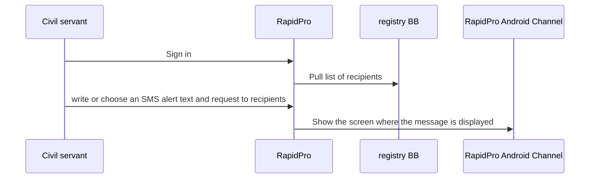

# Mini use case - DRAFT
RapidPro would be “sent a SMS to all health worker informing about XYZ”. On the sandbox, users could access the RapidPro interface, write or choose an SMS alert text and request the list of recipients from a registry BB (openIMIS or emulator). Then, the user triggers the sending. Ideally, there is a screen which shows the receiving end.

## Use case logic

### Requirements

1. The demo is publicly accessible. I can be a separate or the default UI of the BB
2. The demo leverages at least one other BB via X-Road within the Sandbox. E.g. requests the SMS recipients list from Registry BB
3. All involved BBs use GovStack APIs. Adapter might be needed?

### Potential

In a future step, we might think about exposing all RapidPro APIs to the Sandbox. But let's keep that for later.

## Building blocks of a use case

### MHero
mHero is a two-way, mobile phone-based communication system that
connects ministries of health and health workers. It uses data from existing local health information systems to deliver messages via locally popular communication channels. It reduces the barriers that can exist between health workers and their support systems, playing a critical role in ensuring effective and efficient responses, particularly in a crisis.

Health officials can use mHero to:
* Communicate both routine and urgent messages to health workers.
* Target messages to health workers based on cadre, location, or skill set.
* Collect critical information that powers resilient health systems, including stock levels, routine and one-time assessments, and validation of health worker and facility data.
* Build capacity and provide support to health workers, to give them the
  information, skills, and encouragement to deliver quality health services.

Source:
* https://www.mhero.org/about
* https://openhim.org/docs/implementations/mhero/
* https://rapidpro.github.io/rapidpro/docs/development/
* https://hub.docker.com/r/rapidpro/rapidpro

### RapidPro Android Channel
https://github.com/rapidpro/android-channel

The repository is part of the RapidPro project, which is an open-source platform for building interactive messaging systems. RapidPro allows organizations to create and deploy messaging workflows using channels like SMS, voice, and social media. The android-channel repository specifically provides an Android application that serves as a gateway to send and receive SMS messages through the RapidPro platform.

The application is a valuable tool for organizations looking to leverage Android devices as SMS gateways for their messaging workflows on the RapidPro platform. It offers a cost-effective and flexible solution for deploying SMS-based communication systems.

#### Key Features of the android-channel Repository
* SMS Gateway: The Android application acts as an SMS gateway, allowing RapidPro to send and receive SMS messages using an Android phone.
* Integration with RapidPro: It integrates seamlessly with the RapidPro platform, allowing users to leverage their Android device for messaging without needing dedicated hardware or service contracts with SMS aggregators.
* Open Source: The repository is open-source, enabling developers to contribute to the code, customize the application to fit their needs, and ensure transparency and security.

#### Typical Use Cases

* Deploying SMS Campaigns: Organizations can deploy SMS campaigns using an Android phone as a gateway, making it easier to reach a wide audience without incurring significant costs.
* Field Operations: In areas where internet connectivity is limited but mobile networks are available, the Android channel can be used to facilitate communication.
* Rapid Development and Deployment: Developers and organizations can quickly set up and deploy messaging workflows using existing Android devices.

### OpenHIM

https://openhim.org/docs/introduction/about

The Open Health Information Mediator (OpenHIM) is an interoperability layer: a software component that enables easier interoperability between disparate electronic information systems by providing a central point where the exchange of data is managed. An interoperability layer receives transactions from different information systems and coordinates the interactions between them. The OpenHIM provides a layer of abstraction between systems that allows for the transformation of incoming messages to a form that the other system components expect and can support the business logic by orchestrating the transaction flow.

### OpenIMIS / Registry Building Block
https://github.com/GovStackWorkingGroup/sandbox-bb-digital-registries/blob/main/digital-registries/open-imis/docs/main.md

OpenIMIS is an open-source software platform designed to manage and administer health financing schemes, particularly in low- and middle-income countries. It aims to improve the efficiency, transparency, and accountability of health insurance and other health financing programs. The platform supports a wide range of health financing models, including national health insurance, community-based health insurance, and private health insurance.

#### Key Features of openIMIS

* Health Insurance Management: Handles the enrollment of beneficiaries, premium collection, claims processing, and payment to healthcare providers.
* Modular Architecture: Its modular design allows customization and scalability, making it adaptable to different health financing schemes and requirements.
* Integration Capabilities: Can integrate with other health information systems and electronic medical records to streamline operations and improve data accuracy.
* Open Source: Being open-source, openIMIS encourages collaboration and contributions from the global community, ensuring continuous improvement and localization.
* Multi-Language Support: Supports multiple languages, enhancing usability in diverse linguistic regions.
* Mobile and Offline Functionality: Includes mobile applications for field operations and offline capabilities to ensure functionality in areas with limited internet connectivity.

#### Typical Use Cases

* National Health Insurance Programs: Manages the administration of nationwide health insurance schemes, ensuring that beneficiaries receive the appropriate coverage and care.
* Community-Based Health Insurance: Supports smaller-scale, community-driven health insurance schemes, often in rural or underserved areas.
* Private Health Insurance: Enables private insurers to manage their health insurance products more efficiently.
* Healthcare Providers: Assists healthcare providers in managing patient information, processing claims, and receiving payments.