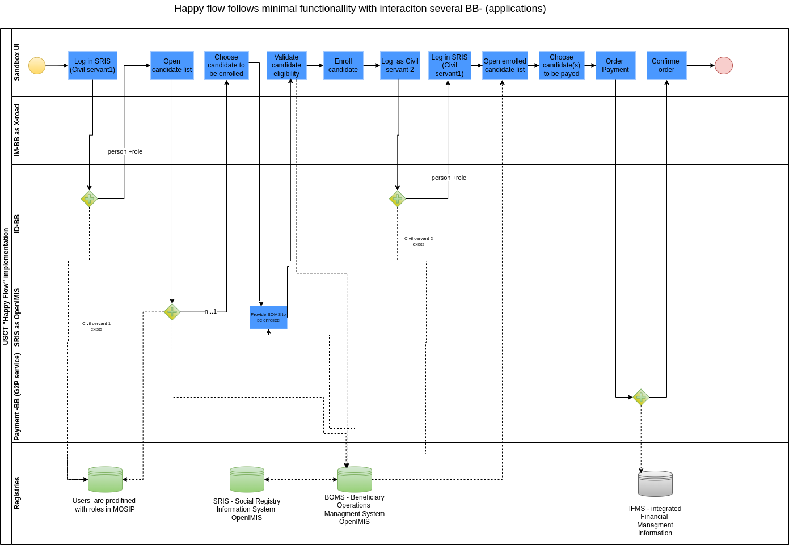

# USCT Use Case

Paragraph on USCT Use Case: Lorem ipsum dolor sit amet, consetetur sadipscing elitr, sed diam nonumy eirmod tempor invidunt ut labore et dolore magna aliquyam erat, sed diam voluptua. At vero eos et accusam et justo duo dolores et ea rebum. Stet clita kasd gubergren, no sea takimata sanctus est Lorem ipsum dolor sit amet. Lorem ipsum dolor sit amet, consetetur sadipscing elitr, sed diam

| Stack Component   | UI Access Point | Note |
| ----------------- | --------------- | ---- |
| Use Case Frontend |                 |      |
| MOSIP Admin UI    |                 |      |
| CircleCI          |                 |      |

## Service Design

## Conceptual Assumptions


Place for e.g. assumption about state/government in which the use case is used. Registries are exisiting. People have internet access...

