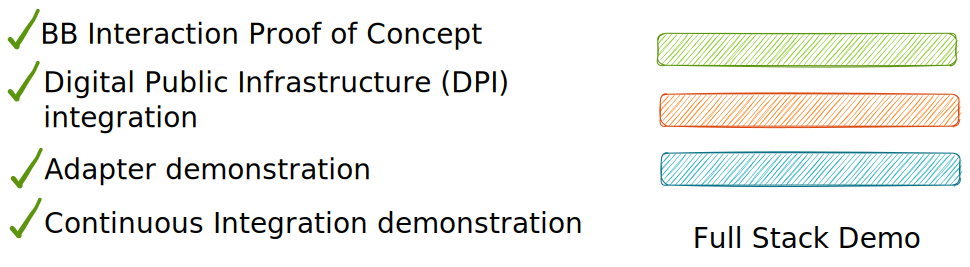

# USCT Use Case

Unconditional Social Cash Transfer (USCT) programs help families meet their basic needs for well-being and safety and serves as their path to self-sufficiency. USCT are cash payments provided to financially disadvantaged or vulnerable people or households without requiring anything in return (i.e. without conditionality).

This demo covers only a small fraction of a USCT user flow for the purpose of using various Building Block APIs. For a more comprehensive visualization of the use case visit the [GovStack USCT simulation](https://www.govstack.global/our-offerings/govspecs/simulation/).

## Access Points

<table data-full-width="false"><thead><tr><th>Stack Component</th><th>UI Access Point</th><th>Note</th></tr></thead><tbody><tr><td>Use Case Frontend</td><td><a href="https://usct.dev.sandbox-playground.com/driver-poc/">Use Case Frontend</a></td><td>
User flow to follow:
<ol><li>Log-in as [role] via embedded MOSIP UI</li><li>... </li></ol></td></tr><tr><td></td><td></td><td></td></tr><tr><td>Building Blocks</td><td>MOSIP Admin UI</td><td></td></tr><tr><td>DevOps</td><td>CircleCI</td><td></td></tr></tbody></table>

## Demonstration

With this use case implementation, we demonstrate the GovStack approach through...


**One possible way to implement the** [**GovStack Specifications**](https://govstack.gitbook.io/specification/)

Browse through all the stack components on the left-hand side menu, to explore the technical details on how we put the specifications into practice.



**Interoperable Digital Public Infrastructure (DPI)**

The use case is enabled by the most foundational Building Blocks: Identity, Payment, Information Mediator. As an implementation of these BB, we set the goal to procure and integrate only Free and Open Source Software (FOSS) and succeeded with: MOSIP, Mifos and X-Road.



**Different Integration Scenarios**

Tbc: Adapters (payment emulator and openIMIS) and native (MOSIP, Mifos, X-Road)

[https://govstack.gitbook.io/specification/architecture-and-nonfunctional-requirements/6-onboarding](https://govstack.gitbook.io/specification/architecture-and-nonfunctional-requirements/6-onboarding)



**Reusability for everyone**

Replicate the whole stack from frontend to infrastructure using our [DYI section](diy/).



**Independent and automated Infrastructure and BB Deployment**

Learn how we reduced dependency on one cloud provider and set-up continuous integration pipelines to ease managing building blocks software candidates.&#x20;


## Service Design


Place for service design assets like journey, blueprint, PBMN


## Conceptual Assumptions


Place for e.g. assumption about state/government in which the use case is used. Registries are existing. People have internet access...

