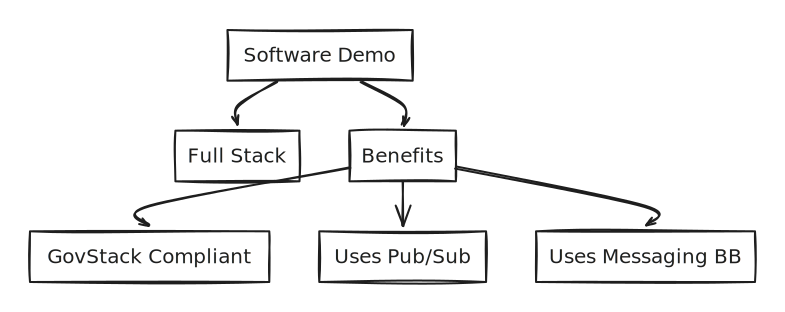

# USCT Use Case

Unconditional Social Cash Transfer (USCT) programs help families meet their basic needs for well-being and safety and serves as their path to self-sufficiency. Unconditional Social Cash Transfer programs provide temporary cash benefits and supportive services to the neediest families.

This demo covers only a small fraction of a USCT user flow for the purpose of using various Building Block APIs. For a more comprehensive visualization of the use case visit the [GovStack USCT simulation](https://www.govstack.global/our-offerings/govspecs/simulation/).

## Access Points

**Data Privacy Note:** By clicking on one of the access points you enter web applications operated by the Deutsche Gesellschaft für Internationale Zusammenarbeit (GIZ) GmbH where these Data Protection Notice and Registration Information are valid.

<table data-full-width="false"><thead><tr><th>Stack Component</th><th>UI Access Point</th><th>Note</th></tr></thead><tbody><tr><td>Use Case Frontend</td><td><a href="https://usct.dev.sandbox-playground.com/driver-poc/">Use Case Frontend</a></td><td>
User flow to follow:
<ol><li>Log-in as [role] via embedded MOSIP UI</li><li>... </li></ol></td></tr><tr><td>Building Block Information Mediator</td><td>X-Road Security Server Admin UI</td><td></td></tr><tr><td>Building Block Identity</td><td>MOSIP Admin UI</td><td></td></tr><tr><td>Building Block Payment</td><td>Mifos Admin UI</td><td></td></tr><tr><td>DevOps</td><td>CircleCI</td><td></td></tr></tbody></table>

## Demonstration

With this use case implementation, we demonstrate the GovStack approach through...


**One possible way to implement the** [**GovStack Specifications**](https://govstack.gitbook.io/specification/)

Browse through all the stack components on the left-hand side menu, to explore the technical details on how we put the specifications into practice.



**Interoperable Digital Public Infrastructure (DPI)**

The use case is enabled by the most foundational Building Blocks: Identity, Payment, Information Mediator. As an implementation of these BB, we set the goal to procure and integrate only Free and Open Source Software (FOSS) and succeeded with: MOSIP, Mifos and X-Road.



**Architectural Best Practices**

Different Integration Scenarios Tbc: Adapters (payment emulator and openIMIS) and native (MOSIP, Mifos, X-Road)

[https://govstack.gitbook.io/specification/architecture-and-nonfunctional-requirements/6-onboarding](https://govstack.gitbook.io/specification/architecture-and-nonfunctional-requirements/6-onboarding)

Callbacks through IM (PubSub?)

UI Switch



**Reusability for everyone**

Replicate the whole stack from frontend to infrastructure using our [DYI section](diy/).



**Independent and automated Infrastructure and BB Deployment**

Learn how we reduced dependency on one cloud provider and set-up continuous integration pipelines to ease managing building blocks software candidates.&#x20;


## Service Design

Place for service design assets like journey, blueprint, PBMN

## Conceptual Assumptions

Place for e.g. assumption about state/government in which the use case is used. Registries are existing. People have internet access...

***

## Data Protection Notice

The following information are valid for all web applications linked in the [access points chapter](usct-use-case.md#access-points).

The Deutsche Gesellschaft für Internationale Zusammenarbeit (GIZ) GmbH attaches great importance to responsible and transparent management of personal data.

Below we provide users with information as to&#x20;

* who they can contact at GIZ on the subject of data protection&#x20;
* what data is processed when they visit the web application
* what rights they have with respect to us

**Controller and Data Protection Officer**

The responsible body for data processing is the Deutsche Gesellschaft für Internationale Zusammenarbeit (GIZ) GmbH.&#x20;

Address: \
Friedrich-Ebert-Allee 32 + 36, 53113 Bonn \
Dag-Hammarskjöld-Weg 1–5, 65760 Eschborn&#x20;

Contact: \
nico.lueck@giz.de

If you have specific questions about the protection of your data, please contact GIZ's data protection officer: datenschutzbeauftragte@giz.de

**General**

GIZ processes personal data exclusively in accordance with the [EU General Data Protection Regulation (GDPR)](https://eur-lex.europa.eu/legal-content/DE/TXT/PDF/?uri=CELEX:32016R0679\&qid=1527147390147\&from=EN) and the [German Federal Data Protection Act (Bundesdatenschutzgesetz, BDSG)](http://www.gesetze-im-internet.de/bdsg\_2018/index.html).\
Personal data are, for example, name, address, email addresses and user behaviour.

GIZ only processes personal data to the extent necessary. Which data is required and processed for which purpose and on what basis is largely determined by the type of service you use or the purpose for which the data is required.

**Collection of personal data when visiting a web application**

When visiting a [web application](usct-use-case.md#access-points), GIZ itself processes only the data that is automatically transmitted by the browser and technically required in order to display the website correctly and to ensure its stability and security. Each time a web application is accessed, the data stored includes, but is not limited to, **the page that is viewed and the IP address of the accessing device**. In Detail:

| Field              | Displayed as    | Description                                                                                                                               |
| ------------------ | --------------- | ----------------------------------------------------------------------------------------------------------------------------------------- |
| Date               | date            | The date on which the activity occurred.                                                                                                  |
| Time               | time            | The time, in coordinated universal time (UTC), at which the activity occurred.                                                            |
| Server IP Address  | s-ip            | The IP address of the server on which the log file entry was generated.                                                                   |
| Method             | cs-method       | The requested action, for example, a GET method.                                                                                          |
| URI Stem           | cs-uri-stem     | The target of the action, for example, Default.htm.                                                                                       |
| URI Query          | cs-uri-query    | The query, if any that the client was trying to perform. A Universal Resource Identifier (URI) query is necessary only for dynamic pages. |
| Server Port        | s-port          | The server port number that is configured for the service.                                                                                |
| User Name          | cs-username     | The name of the authenticated user who accessed your server. Anonymous users are indicated by a hyphen.                                   |
| Client IP Address  | c-ip            | The IP address of the client that made the request.                                                                                       |
| User Agent         | cs(User-Agent)  | The browser type that the client used.                                                                                                    |
| Referrer           | cs(Referrer)    | The site that the user last visited. This site provided a link to the current site.                                                       |
| HTTP Status        | sc-status       | The HTTP status code.                                                                                                                     |
| Protocol Substatus | sc-substatus    | The sub status error code.                                                                                                                |
| Win32 Status       | sc-win32-status | The Windows status code.                                                                                                                  |
| Time Taken         | time-taken      | The length of time that the action took, in milliseconds.                                                                                 |

The data in the log file is deleted after <mark style="background-color:yellow;">\[number]</mark> days.

Further information on the storage and transfer of data:

GIZ is obliged to store data beyond the time of the visit in order to ensure protection against attacks on the GIZ’s internet infrastructure and the communications technology of the Federal Government (legal basis: Art. 6 (1) (e) GDPR in conjunction with Section 5 BSI Act). In the event of attacks on communications technology, this data is analyzed and used to initiate legal and criminal prosecution.

Data logged when accessing the GIZ's web applications is only transmitted to third parties if there is a legal obligation to do so or if the transmission is necessary for legal or criminal prosecution in the event of attacks on the Federal Government's communications technology. Data will not be passed on in any other cases. This data is not merged with other data sources at GIZ.

**Information on opting out**&#x20;

Users who do not agree with the described processing of data cannot access the web applications. For technical reasons, opting out is not possible.

**Disclosure to third parties**

GIZ does not pass on personal data to third parties unless it is legally obliged or entitled to do so by law.&#x20;

**Transfer of data to countries outside Germany**

GIZ does not transfer personal data to third countries. When using social media, the privacy policies of the respective providers apply.&#x20;

**Duration of data retention**

User data will not be kept any longer than is necessary for the purpose for which it is processed or as required by law.

**IT security of user data**

GIZ accords great importance to protecting personal data. For this reason, technical and organisational security measures ensure that data is protected against accidental and intentional manipulation and unintended erasure as well as unauthorised access. These measures are updated accordingly based on technical developments and adapted continuously in line with the risks.

Reference to user rights

Visitors to the GIZ website have the right

* To obtain **information** about their data stored by us (Article 15 GDPR)
* To have their data stored by us **rectified** (Article 16 GDPR)
* To have their data stored by us **erased** (Article 17 GDPR)
* To obtain **restriction** of processing of their data stored by us (Article 18 GDPR)&#x20;
* To **object** to the storage of their data if personal data are processed on the basis of the first sentence of Article 6 (1) 1 f and e GDPR (Article 21 GDPR)&#x20;
* To receive their personal data in a commonly used and machine-readable format from the controller such that they can be potentially transmitted to another controller (right to **data portability**, Article 20 GDPR).
* To **withdraw** their consent to the extent that the data has been processed on the basis of consent (Article 6 (1) a GDPR). The lawfulness of the processing on the basis of the consent given remains unaffected until receipt of the withdrawal.

Users also have the right in accordance with Article 77 GDPR to **lodge a complaint with the competent data protection supervisory authority**. The competent authority is the Federal Commissioner for Data Protection and Freedom of Information ([BfDI](https://www.bfdi.bund.de/EN/Home/home\_node.html)). &#x20;

## Registration Information

The following information are valid for all web applications linked in the [access points chapter](usct-use-case.md#access-points).

Deutsche Gesellschaft für Internationale Zusammenarbeit (GIZ) GmbH

**Registered offices**

Bonn and Eschborn\
Germany

Friedrich-Ebert-Allee 32 + 36\
53113 Bonn\
Germany\
T +49 228 44 60-0\
F +49 228 44 60-17 66

Dag-Hammarskjöld-Weg 1 - 5\
65760 Eschborn\
Germany\
T +49 61 96 79-0\
F +49 61 96 79-11 15

E info@giz.de\
I www.giz.de

**Registered at**

Local court (Amtsgericht) Bonn, Germany: HRB 18384\
Local court (Amtsgericht) Frankfurt am Main, Germany: HRB 12394

**VAT no.**

DE 113891176

**Chairperson of the Supervisory Board**

Jochen Flasbarth, State Secretary in the Federal Ministry for Economic Cooperation and Development

**Management Board**

Thorsten Schäfer-Gümbel (Chair) \
Ingrid-Gabriela Hoven (Vice-Chair)\
Anna Sophie Herken

