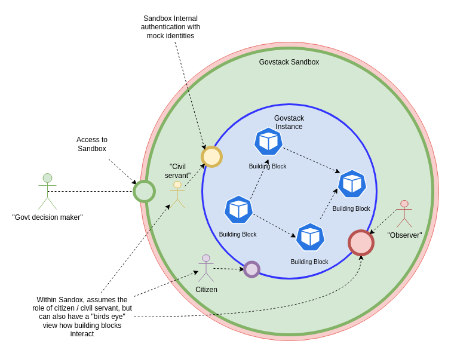
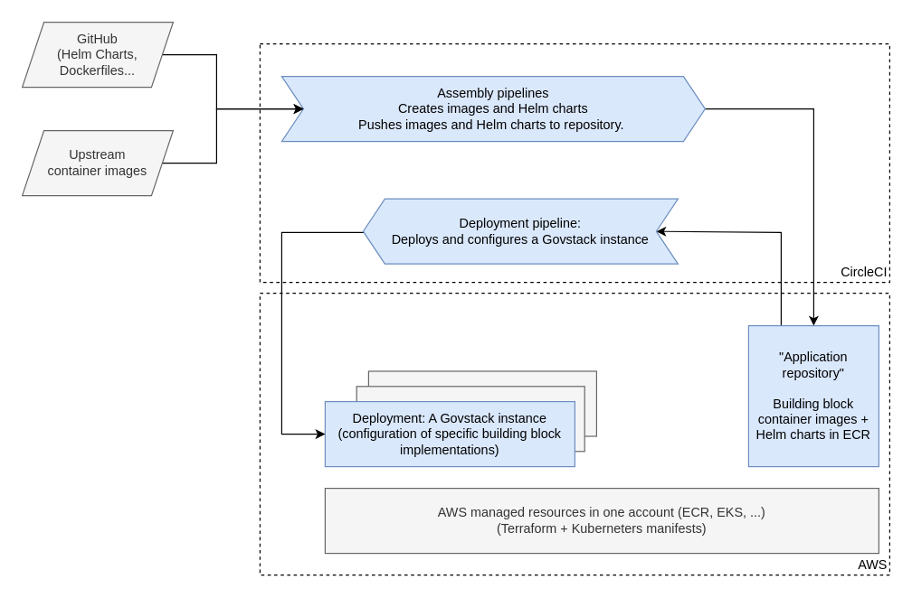
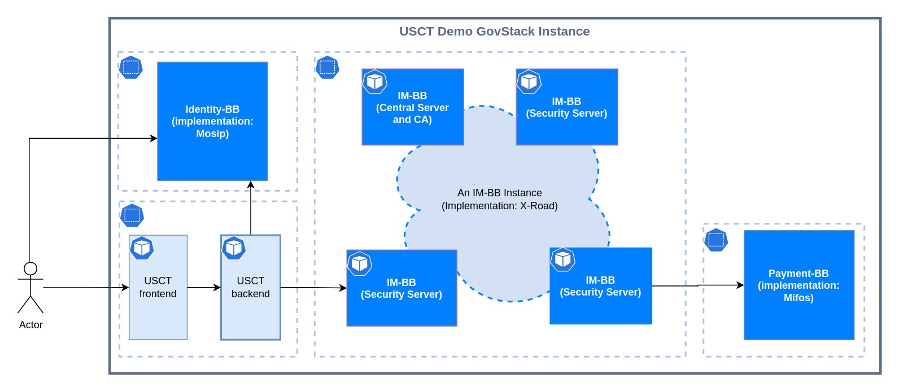

# Architecture

The GovStack Sandbox aims to be an isolated, safe environment simulating a small governmental e-service system (reference implementation of the [GovStack architecture](https://govstack.gitbook.io/specification/architecture-and-nonfunctional-requirements)). The Sandbox is not intended to be a production environment; it is a demonstration environment to learn and a technical environment to test and develop digital government services.

A conceptual view of the Sandbox is illustrated in the diagram above. Since the Sandbox is an isolated environment, how to *access* the applications within the Sandbox is left unspecified. In the Govstack Sandbox reference/demo implementation, some applications are exposed publicly. A private deployment could restrict access e.g. using a VPN, but give developers full access to the environment to see what is happening behind the scenes.

The Sandbox is itself built from "building blocks":

* An execution environment for deploying, executing, and inspecting building block instances.
    * A Kubernetes cluster is used as an abstraction of compute and networking resources. A managed Kubernetes service is available from several clould providers, and it scales from single-node deployments to huge clusters.
    * The cluster needs to support stateful applications (e.g. provide support for dynamically provisioned persistent volumes).
* Set of building block implementations, packaged and pre-configured for deployment into the execution environment.
    * Sandbox-compatible building block implementations are packaged as OCI containers and Helm charts.
* Demo applications showcasing the use of building blocks (also packaged as OCI containers and Helm charts).
* Assembly pipelines that package the applications .
* Deployment pipelines that handle the deployment and configuration.

An overview of the GovStack Sandbox implementation is illustrated in the following diagram. The reference implementation is hosted in AWS, and uses CircleCI for assembly and deployment pipelines.

The objective of the architecture is to allow flexible selection of Sandbox components, depending on need:

* Select a building block implementation and deploy it locally (using minikube, mikrok8s, ...) to examine it further.
* Deploy a configuration of building blocks and demo applications to an Kubernetes cluster to experience a end-to-end solution.
* Use the provided infrastructure scripts as a blueprint to set up own development environment and build pipelines.

The following diagram shows an Govstack instance with the necessary building blocks required for the USCT demo application.

The deployed components in this scenario are:
* The USCT demo application
* Identity building block for authentication
* [Information Mediator](https://govstack.gitbook.io/bb-information-mediation/), a core component of the GovStack architecture
* Payment building block implementation used in the scenario

## Approach for building block Sandbox deployment

Two approaches for deployment:

* The building block deployment is self-contained and deployed inside the Sandbox (preferred for keeping the "safe and isolated environment" property, but not always possible).
* The building block implementation provides a gateway component that is deployed inside the Sandbox. The gateway provides s GovStack-compliant API and transparently accesses the externally deployed application (details out of scope).

### Packaging guidelines for a self-contained application deployed into a Sandbox

* Building block applications should be provided as one or more OCI compliant container images ("Docker images") and packaged using a Helm (version 3) chart that defines the resources required by the application.
    * For example, if the application uses a database, the deployment should define one.
* The chart should define a minimal, small scale deployment for exploration and development, covering only the essential components and functionality.
* The deployment should only depend on basic Kubernetes concepts and abstractions (e.g. deployments, pods, config maps, secrets, services, persistent volume claims).
* The application should be isolated into a Kubernetes namespace. The namespace name should be configurable during the chart install time.
* An application can not expect control of the cluster, and should not depend on advanced features like custom Kubernetes controllers.
* The application should not expose any interfaces by default (e.g. ingresses should be opt-in or disabled).
* The application should not, in general, require access to external resources in the Internet, but it can use other building blocks deployed in the same Sandbox.
* *Configurable*: The deployment should include means for providing initial configuration for the application. For example, the application can provide additional configuration APIs, read configuration provided via a ConfigMap at deployment time, or the configuration can be (partially) baked in to the container images. The exact mechanism is implementation specific, but should be scriptable (not require manual steps or using an UI).
* *Automatic deployment*: The deployment should be fully automated so that the deployment can be triggered e.g. from a CI/CD pipeline. Installing the chart with possible additional deployment-time configuration should start the application in a known, working state.
    * Preferably, the deployment should include basic tests that can be used to verify a successful deployment, and it should be possible to integrate the tests to the pipeline.

