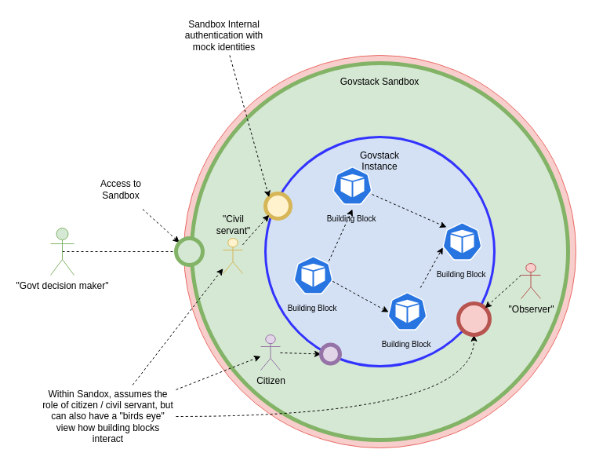
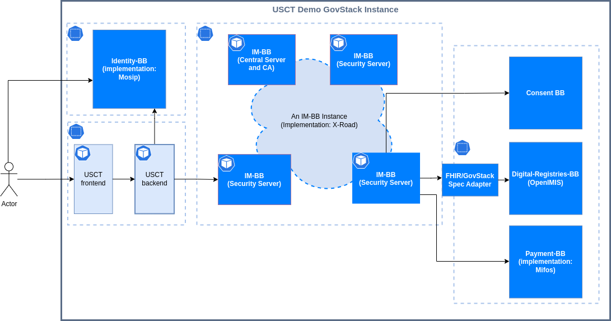

# Architecture

The GovStack Sandbox aims to be an isolated, safe environment simulating a small governmental e-service system (reference implementation of the [GovStack architecture](https://govstack.gitbook.io/specification/architecture-and-nonfunctional-requirements)). The Sandbox is not intended to be a production environment; it is a demonstration environment to learn and a technical environment to test and develop digital government services.

A conceptual view of the Sandbox is illustrated in the diagram above. Since the Sandbox is an isolated environment, how to *access* the applications within the Sandbox is left unspecified. In the Govstack Sandbox reference/demo implementation, some applications are exposed publicly. A private deployment could restrict access e.g. using a VPN, but give developers full access to the environment to see what is happening behind the scenes.

The Sandbox is built from several components:

* An execution environment for deploying, executing, and inspecting building block instances.
    * A Kubernetes cluster is used as an abstraction of compute and networking resources. A managed Kubernetes service is available from several clould providers, and it scales from single-node deployments to huge clusters.
    * The cluster needs to support stateful applications (e.g. provide support for dynamically provisioned persistent volumes).
* Set of building block implementations, packaged and pre-configured for deployment into the execution environment.
    * Sandbox-compatible building block implementations are packaged as OCI containers and Helm charts.
* Demo applications showcasing the use of building blocks (also packaged as OCI containers and Helm charts).
* Assembly pipelines that package the applications .
* Deployment pipelines that handle the deployment and configuration.

An overview of the GovStack Sandbox implementation is illustrated in the following diagram. The reference implementation is hosted in AWS, and uses CircleCI for assembly and deployment pipelines.

The objective of the approach is to allow flexible selection of Sandbox components, depending on need:

* Select a building block implementation and deploy it locally (using minikube, mikrok8s, ...) to examine it further.
    * The Dockerfiles and Helm Charts are published, making it possible to build the images locally and to customize the deployment to specific needs. 
* Deploy a configuration of building blocks and demo applications to an Kubernetes cluster to experience an end-to-end solution.
* Use the provided infrastructure scripts as a blueprint to set up own development environment and build pipelines.

The following diagram shows a Govstack instance with building blocks implementations required for the USCT demo application.

The deployed components in this scenario are:
* The USCT demo application
* [Identity building block](https://govstack.gitbook.io/bb-identity/) for authentication.
* [Information Mediator](https://govstack.gitbook.io/bb-information-mediation/), a core component of the GovStack architecture
* Payment building block implementation used in the scenario
