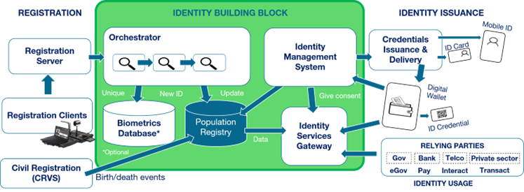

# Identity: MOSIP



## Functional Scope

* Identity Usage: Authenticate a person, share personal attributes using a KYC API
* Identity Management: Create a Foundational Identity, update it, generate token identifier or link existing forms of identities.
* Credential Management: Generate digital or physical Identity Credentials containing personal information, manage their lifecycle
* Subscription Management: Subscribe to identity update event and be notified about personal information change.
* Administration: Configuration of the Identity Building Block

See also [Identity Specifications on GovStack GitBook](https://govstack.gitbook.io/bb-identity)

## Architecture

<figure><figcaption>
MOSIP architecture
</figcaption></figure>

Identity Building Block has a modular approach. These are the high-level modules of Identity BB:

**Registration Clients:** These are specialized machines that have biometrics devices attached. These machines host the client software used for enrollment/registration of the citizens/residents. The client software will encrypt all the data and create a packet for processing.

**Registration Server:** This the backend server that processes the enrollment/registration requests. One of the important functions of this server is to de-duplicate the demographic and bio-metric information for the enrolled citizens/residents. On successful registration, it will generate a Unique Identity Number (UIN).

**Orchestrator:** This module provides the necessary automation and security required to push the biometrics and UIN information to other systems such as Public Registry and Biometrics database.

**Identity Management System:** This module is responsible for the identity credentials lifecycle management and user consent for sharing demographic information (name, gender, date of birth, etc.) including the facial image post user consent.

**Identity Service Gateway:** This module provides a secure and authorized API gateway to the Identity Management System.

**Credentials Issuance and Delivery:** This module is responsible for sharing identity credentials with the printing services and digital delivery systems. The actual printing, electronic UIN formatting, QR code, etc. are handled by third-party authorized systems.

**Relying Party:** These are partner applications external to Identity Building Block. The relying party applications use Identity Service Gateway to authenticate enrolled citizens/residents and access their demographic information and facial image.

**CRVS:** These are registries external to the Identity Building Block. These registries will inform the Identity BB about birth/death registration and get notified when UIN is generated.

## Technology Stack



## Key Considerations for Implementation

* What are the pre-existing trusted forms of identity (physical documents, digital IDs, or identity registries)?
* What's the legal framework in place for identification
  * Personal data collection, use and sharing
  * Use of biometrics
  * Unique identification of individuals
  * Recognition of Digital Signature as legal form of signature
* Can individuals register themselves online? If yes, then what kind of information can be collected online?
* If registration information is collected in a registration centre, then what kind of security and privacy-preserving measures should be in place for the Registration portal?
* If registration information is collected offline then which designated roles are authorized to collect the demographic data, biometric data, and supporting documents?
* What are the security and privacy measures required for sending registration information online (use of HTTPS browsers, encryption, digital certifications, etc.)?
* How are various registration devices (host machines, printers, scanners, biometric devices) secured against malicious attacks?
* What kind of infrastructure security be provided at the registration centres (physical security of registration devices, protection against natural calamities, attacks, etc.)?
* Should individual’s biometrics be collected? What is the minimum quality required for biometrics?
* What standards (ISO-19794) should be implemented by the biometric devices?
* What is the process to authorize biometric devices before allowing them to collect fingerprints, iris, or face?
* What is the process to make sure that the biometric information is coming from trusted and authorized biometric devices?
* How are individuals notified about successful/failed registrations?
* How are printing partners authorized to print the Identity cards?
* How are the digital identity cards delivered securely?
* How much identity information can be shared with the identity BB partners (such as Telecom Service Providers, Hospitals, Banks)?
* How will these partners be onboarded?
* How are the identities verified as unique and real?
* How is the unique identity information preserved, i.e. using OIDC interfaces?
* What can be shared without compromising security and privacy of the end-user?

## Code Repositories








