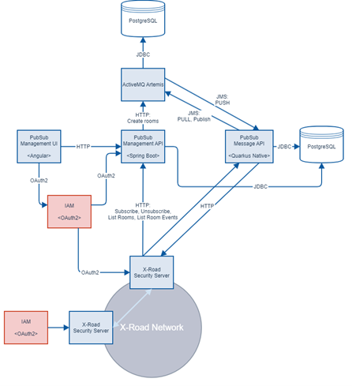

# Information Mediator: X-Road





## Functional Scope

The information mediator (IM) building block (BB) provides a gateway for exchange of data and services among GovStack Building blocks through open-API rest based interfaces to ensure interoperability and implementation of standards. The IM provides mechanisms for applications/BBs to publish and consume services and event notifications among other GovStack BBs.

The Information Mediation Building Block has two following responsibilities:

* Ensure the integrity, confidentiality, and availability of data transmission between the building blocks.
* Enable event mesh layer architecture by allowing applications to communicate through asynchronous events.

On top of responsibilities above, the IM-BB grid shall also enable managing the enrolled IM-BB instances in GovStack environment and on IM-BB level authorize access to member provided applications and room events.

Interfaces and services provided by the IM-BB are grouped by the areas of the above-mentioned responsibilities and use cases provided in the RFP, composing two main components: Security Servers & Central Server and Publish Subscribe Service.

See also [Information Mediator Specifications on GovStack GitBook](https://govstack.gitbook.io/bb-information-mediation)

## Architecture

<figure><figcaption>
X-Road architecture
</figcaption></figure>

Internally, the components adhere to the hexagonal architecture, also known as the “ports and adapters” architecture. At the core of the solution is the interaction between ActiveMQ Artemis and the X-Road Security Server. The X-Road Security Server provides a secure outward-facing interface to X-Road's interoperability layer. ActiveMQ Artemis is responsible for holding and managing the message queues.

The **X-Road Security Server** is directly managed by the service owner, while **ActiveMQ** Artemis is not directly managed. ActiveMQ Artemis does have a management interface, which can be used to monitor or modify communications; however, it is not connected to the system's Identity and Access Management (IAM) and has only two preconfigured accesses: the Management API and the Messaging API.

Given the need for more fine-grained user access control than ActiveMQ Artemis provides, two components are introduced: the Management API and the Messaging API. Each of these components is registered as a subsystem in the X-Road Security Server.

The **Messaging API** serves as a proxy between the X-Road Security Server and ActiveMQ Artemis. Its primary function is to provide messaging control (who can access which rooms or messages) based on identity information received from the X-Road protocol, and profiles stored in the Messaging API’s database.

A secondary function of the Messaging API is to enable Exponential Backoff Retry (EBR), which is supported in ActiveMQ Artemis only at the broker level. The specifications were set to provide EBR at both the room and subscriber levels. For this purpose, specific headers are added to ActiveMQ Artemis messages, and the Messaging API reschedules delivery to a subscriber based on the rooms' or subscribers' EBR settings.

The main functionality of the **Management API** is to set and manage stored profiles (including persons, rooms, subscriptions, etc.). The Management API and Messaging API, while separately deployable, are strongly coupled and use the same database. The Messaging API provides a subset of its functions over X-Road and is thus registered in the X-Road Security Server. It is also connected to ActiveMQ Artemis for the purpose of room management. Aside from setting a shared context of a room or subscription in its database, the Management API must also provide this for ActiveMQ Artemis.

The **Management UI** is a custom user interface intended for local (inter-organization) use only. It provides an interface for the local service administrator to manage all aspects of the PubSub instance through a web browser.

Both the X-Road Security Server and the Management API/UI rely on an OAuth2-compliant IAM solution for local administrators. In this case, an instance of KeyCloak is deployed and configured for this purpose.

## Technology Stack

### Frontend Technologies

| Technology | Description                                                                                        | Rationale                                                                                                                                                                                                                                                                                                                                                               |
| ---------- | -------------------------------------------------------------------------------------------------- | ----------------------------------------------------------------------------------------------------------------------------------------------------------------------------------------------------------------------------------------------------------------------------------------------------------------------------------------------------------------------- |
| Vite       | 
A modern frontend build tool, providing a faster and leaner development experience.

 
 | 
Chosen for their speed and efficiency in building interactive UIs. Vue's reactive components and Vite's fast refreshing make development quicker and more efficient. It is also used for the X-Road Security Server administrative interface, providing a unified “look and feel” of the IM-BB solution and enabling further integrations in the future.

 
 |
| Vue.js     | A progressive JavaScript framework used for building user interfaces.                              |                                                                                                                                                                                                                                                                                                                                                                         |
| Vuetify    | A Vue UI Library with beautifully handcrafted Material Components.                                 | Provides a wide range of ready-to-use material design components, speeding up the development process.                                                                                                                                                                                                                                                                  |
| Pinia      | State management for Vue.js.                                                                       | 
These are standard choices for state management and routing in Vue applications, ensuring a consistent and scalable structure.

 
                                                                                                                                                                                                                           |
| Vue Router | The official router for Vue.js.                                                                    |                                                                                                                                                                                                                                                                                                                                                                         |
| Axios      | A promise-based HTTP client for making HTTP requests.                                              | Widely used for HTTP requests, known for its ease of use and flexibility.                                                                                                                                                                                                                                                                                               |
| Day.js     | A minimalist JavaScript library for parsing, validating, manipulating, and formatting dates.       | Chosen for their minimalistic and high-performance characteristics, ensuring fast processing and small bundle sizes.                                                                                                                                                                                                                                                    |
| Esbuild    | An extremely fast JavaScript bundler.                                                              |                                                                                                                                                                                                                                                                                                                                                                         |
| TypeScript | A superset of JavaScript that compiles to clean JavaScript output.                                 | Offer additional features over JavaScript and CSS, like types and variables, for better maintainability and scalability.                                                                                                                                                                                                                                                |
| Sass       | A preprocessor scripting language that is interpreted or compiled into CSS.                        |                                                                                                                                                                                                                                                                                                                                                                         |

### Backend Technologies

| Technology       | Description                                                                                                                   | Rationale                                                                                                                                                                                                            |
| ---------------- | ----------------------------------------------------------------------------------------------------------------------------- | -------------------------------------------------------------------------------------------------------------------------------------------------------------------------------------------------------------------- |
| Quarkus          | A Kubernetes Native Java framework tailored for GraalVM and HotSpot, crafted from best-of-breed Java libraries and standards. | Offers a modern Java stack that is optimized for containers and cloud deployments. It's efficient for microservices architecture.                                                                                    |
| Spring Framework | Including Spring Boot, Spring Security, and other Spring modules for building robust Java applications.                       | Spring Boot simplifies the setup and development of new applications. Spring Security adds robust security features. Spring's ecosystem provides extensive support for different aspects of application development. |
| ActiveMQ Artemis | A multi-protocol, embeddable, very high performance, clustered, asynchronous messaging system.                                | Provides robust messaging capabilities, necessary for handling complex asynchronous communications.                                                                                                                  |
| JOoQ             | A fluent API for typesafe SQL query construction and execution.                                                               | For its fluent API, making database interactions more intuitive and type safe.                                                                                                                                       |
| X-Road           | A software that provides a secure layer for data exchange between different systems.                                          | Ensures secure data transfer between systems, aligning with the need for high data security and integrity.                                                                                                           |
| KeyCloak         | An open-source Identity and Access Management solution.                                                                       | Integrates with the system for secure and flexible identity and access management.                                                                                                                                   |

### Database Technologies

| Technology  | Description                                                         | Rationale                                                                                                               |
| ----------- | ------------------------------------------------------------------- | ----------------------------------------------------------------------------------------------------------------------- |
| PostgreSQL  | An advanced open source relational database.                        | A powerful, open-source object-relational database system, known for reliability, feature robustness, and performance.  |
| H2 Database | A lightweight Java database which is used in the development phase. | Useful for development and testing due to its lightweight nature.                                                       |
| Liquibase   | An open-source database schema change management tool.              | Facilitates tracking, managing, and applying database schema changes, crucial for maintaining database version control. |

The selection of these technologies aligns well with the hexagonal architecture (ports and adapters) model, as they support modular and scalable system design. The use of modern, high-performance, and widely supported technologies ensures the system is robust, scalable, and secure.

## Code Repositories








