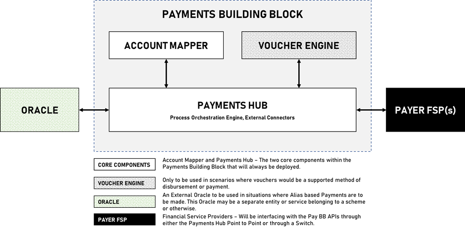
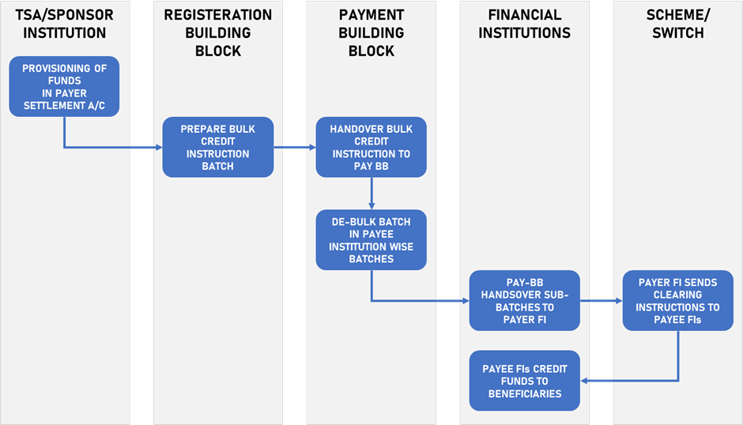
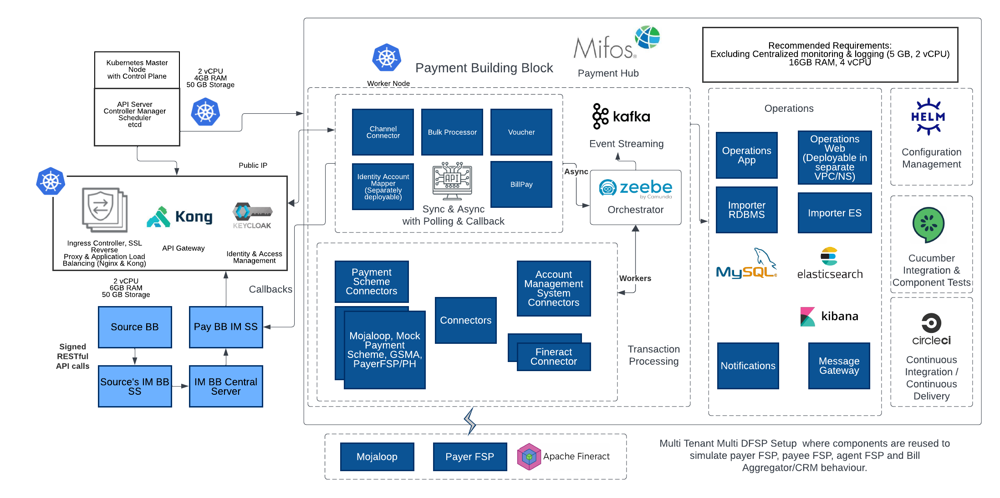
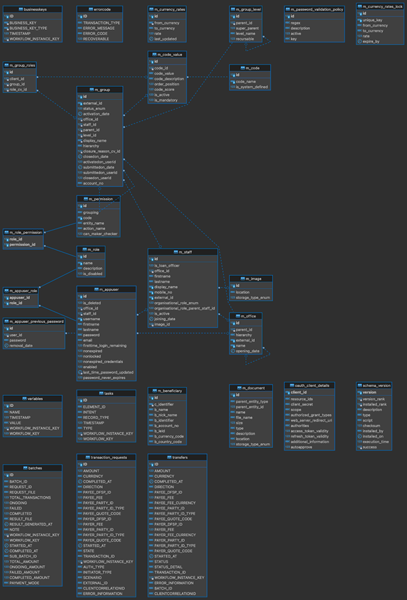

# Payment: Mifos Payment Hub



## Functional Scope

The Payments Building Block is an ICT Building Block that enables digital financial payments to be tracked, evaluated, initiated, validated, processed, logged, compared, and verified. It also provides interoperability with external applications that require payment services to trigger transitions in their workflow through Financial Service Providers. The Payments Building Block interfaces with regulated financial entities such as banks, credit facilities, and insurance companies through point-to-point integrations or gateways. It converts heterogeneous interface protocols, formats, and user interfaces to a standard set of common interfaces and formats, making it easier for users and government to complete payment transactions and learn if their transaction succeeded or failed.

### Introduction to Payment Building Block

The Payment Building Block itself consists of five different modules, two of these are core modules that would be part of every implementation regardless of jurisdiction, these are components that are fundamentally required for processing of G2P Payments. This is the Account Mapper and the Payments Hub.

Apart from these there are two supporting components that would be required where needed. The Voucher Engine would be required where the Payments Building Block is expected to support issuance and redemption of vouchers as a mode of payment offline. And an external Oracle would be required to provide Alias Lookup services if a jurisdiction wishes to enable pay by alias but does not have existing alias management infrastructure.

<figure><figcaption></figcaption></figure>

The Mojaloop switch may be required if a jurisdiction does not have a switch or if compulsions deem the existing switch/scheme inaccessible, and a switch is required to interface with Financial Institutions, however, this is not to be confused as an integral part of component of the payments building block. The Mojaloop Switch could be used but its governance and operations will be completely outside the scope of the Payments Building Block and is usually done by a scheme.

#### Payment Hub

This is the core processing engine that will perform payment orchestration and operations such as bulking/de-bulking of instructions, this is also the component that will integrate with Financial Institutions of Schemes/Switches where needed.

#### Account Mapper

The account mapper service identifies the FSP, and exact destination address where the merchant/agent/payee’s account that is used to route payouts to beneficiaries or settlement payments to agents/merchants.

#### Voucher Engine

This is the core voucher engine, the voucher component of the Payment Building Block facilitates the provisioning, issuance, activation, and redemption of vouchers. During the voucher provisioning process, sufficient funds must be allocated to the voucher. Vouchers can be issued but are not usable until they are in the hands of the beneficiary. The activation process makes the voucher active and usable for specific use cases and a limited time. When the vouchers are appropriately used, beneficiaries receive benefits in the form of cash, products, or services from a third party, such as an agent or merchant.

#### Oracle

This is the Alias Lookup Service that is to be used for payments (if available in a jurisdiction) to be made without having to exchange sensitive payment information such as bank account numbers. Instead, beneficiaries can use an alias, which is a unique identifier that represents the user's payment information. This is optional because some jurisdictions may have Alias Lookup Service while others may not. If an ALS is not present but desired, the Mojaloop Oracle could be used but its governance and operations will be completely outside the scope of the Payments Building Block and is usually done by a scheme.

### Government to Person Payments through the Payments Building Block

### Introduction to G2P

G2P is broadly defined as the class of payments made by government entities (such as national or local governments) to individual citizens. These payments can take many forms, including social welfare benefits (such as pensions, unemployment benefits, or subsidies), compensation for public sector employment, or other forms of assistance. The goal of G2P payments is typically to provide support to individuals who need it and to stimulate economic activity in each region or country. The process of making these payments can be complex and requires effective systems for identification, payment processing, and fund disbursement.

The objective of this endeavor is to provide a standard approach for all G2P payment use cases (ie whether conditional or Unconditional Social Cash transfer) in terms of API interfaces that need to be provided to the G2P Beneficiary Program Building Block as well as Payroll application to call the Payments BB to effect the all aspects of a Bulk Payment. These include the Provisioning of funds (pre-funding of the FSP accounts via the TSA or in a settlement account at an FSP), Clearing (the process of providing bulk processing instructions, validating them, and preparing instructions) and disbursement (actual settlement of funds post clearing).

In the process documented in the use case documents, payments instructions are passed in a standard format in the form of a Batch Payment file for the disbursement to each Beneficiary and these clearing instructions are processed by Payment BB. However, we must be cognizant that payments are a complex subject and there is no one size fits all, this is why the Payment BB has to support disbursement through various payment channels such as bank accounts, mobile wallets, digital wallets, alias-based payments, and where necessary through vouchers. As a result of this desired flexibility, payment flows can vary depending on whether the Payee has a store of value (Bank account, Mobile money account or any electronic money wallet) OR the payee will collect the payment using some sort of voucher that is to be redeemed through an identification and authentication process. This document aims to capture these varying flows and possibilities.

Throughout this project, we use the term “Payment Modality” to describe whether the beneficiary/merchant/agent receiving the payment prefers or is able to receive it in an account, mobile wallet or via vouchers (only applicable in the case of beneficiaries and with or without some sort of foundational ID authentication).

### Bulk Payments Process

The Bulk Processing component of the Payments Building Block manages batch de-bulking on the basis of payee institutions and shares them with the Payer Bank for onward processing of bulk payment instructions. This component is also responsible for validating before executing a batch payment that the initiating agency has provisioned sufficient funds, it also maintains an end-to-end reconciliation service to track status of posted instructions at payee institutions.

<figure><figcaption>
Figure 02 – Core Functions in the Bulk Disbursement Process
</figcaption></figure>

| Provisioning of Funds                             | 
The government ministry/agency/organization ensures the provisioning of funds which may be either through the Treasury Single Account at the Central Bank or at a State-Owned Bank, or through a sponsored account at a Commercial Financial Institution. This is assumed to be a manual process where the TSA/Sponsoring FI is notified by the Ministry of their intent to initiate a bulk transfer so that sufficient provisioning of funds can be ensured.

 

The same provisioning is communicated to the Payment BB so that it can maintain its own ledgers to validate that bulk payments don’t exceed capacity.
 |
| ------------------------------------------------- | ---------------------------------------------------------------------------------------------------------------------------------------------------------------------------------------------------------------------------------------------------------------------------------------------------------------------------------------------------------------------------------------------------------------------------------------------------------------------------------------------------------------------------------------------------------------------------------------------------------------------------------------- |
| Preparation of Bulk Credit Batch                  | The government ministry/agency/organization manages their beneficiary list in the registeration building block, finalized beneficiary lists are created and disbursement schedules is maintained within the Registeration Building Block.                                                                                                                                                                                                                                                                                                                                                                                                |
| Send Bulk Instructions to Payments Building Block | The Registeration BB calls the Payments BB API to handover a bulked credit instruction batch.                                                                                                                                                                                                                                                                                                                                                                                                                                                                                                                                            |
| De-bulk Payment Batch                             | The Payment BB de-bulks the large payments batch payee institution wise.                                                                                                                                                                                                                                                                                                                                                                                                                                                                                                                                                                 |
| Send Sub-batches to Payer FSP                     | The Payment BB sends the multiple de-bulked sub-batches to the Payer FSP.                                                                                                                                                                                                                                                                                                                                                                                                                                                                                                                                                                |
| Clearing Instructions                             | Payer FI sends clearing instructions (either individual credit messages or a single large bulk credit message with multiple instructions however the scheme supports) to the Payee FIs through the prevalent scheme/switch ecosystem.                                                                                                                                                                                                                                                                                                                                                                                                    |
| Post funds to beneficiaries                       | Payee FIs post funds to beneficiary accounts/mobile wallets.                                                                                                                                                                                                                                                                                                                                                                                                                                                                                                                                                                             |

## Architecture

### Solution Architecture

<figure><figcaption></figcaption></figure>

### Data Architecture

Payment hub follows a headless architecture in which transactional services store data asynchronously into real-time analytics and OLTP datastore. Orchestration (Zeebe) engine's embedded database (RocksDB) stores execution (workflow) variables and states of a transaction.

A Kafka Exporter exports orchestrator's independent event streams to Kafka. This is then streamed by importer services and persisted into both relational databases (MySQL) and real time search / analytical data store (Elasticsearch). This data then can be used for operational and analytical use cases.

Prometheus serves as a store for performance monitoring of the stack (especially for the orchestrator).

The business logic is encapsulated into Zeebe workers and assembled in use case and implementation flows (configurations dragged and dropped in a modeling tool called Zeebe modeler). These transactional flows are completely separated from the data storage and retrieval mechanisms. Data stored within Elasticsearch is in real-time and is eventually consistent.

<figure><figcaption></figcaption></figure>

## More Information


