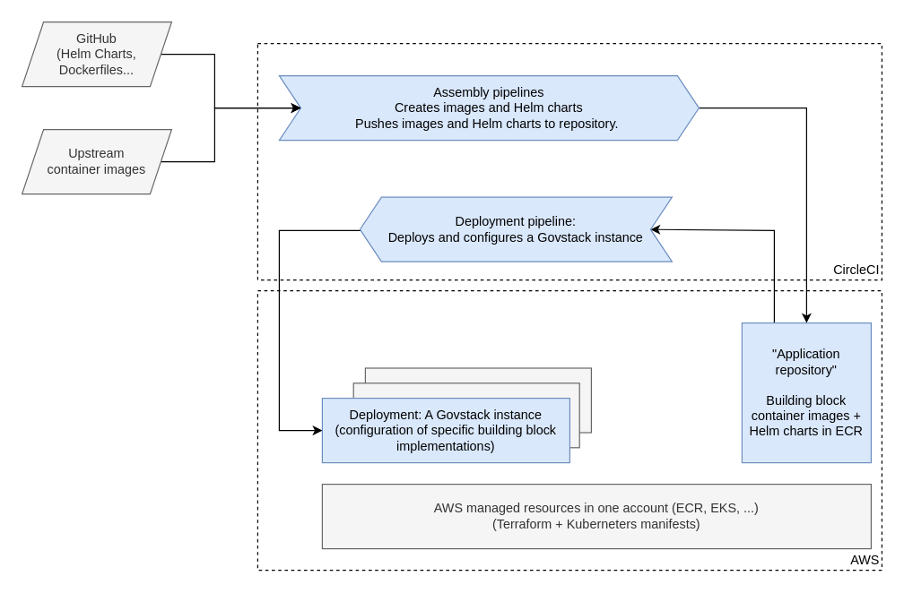

# DevOps approach for building block Sandbox deployment

The journey of a building block implementation to deployment into a Sandbox is illustrated in the following diagram.

The process is logically divided into assembly and deployment steps (the current reference implementations combine these into a single pipeline):

* An assembly pipeline creates a "sandboxed" version of the building block implementation and pushes it to the Sandbox container registry. This process, for example, can provide the images with sensible configurations and mock data used in scenarios.
* A deployment pipeline deploys a set of building block applications to assemble a Govstack instance – a specific configuration of building blocks needed to support a scenario (or set of scenarios).

### Two approaches for deployment:

* The building block deployment is self-contained and deployed inside the Sandbox (preferred for keeping the "safe and isolated environment" property, but not always possible).
* The building block implementation provides a gateway component that is deployed inside the Sandbox. The gateway provides s GovStack-compliant API and transparently accesses the externally deployed application (details out of scope).

### Building block packaging guidelines for Sandbox deployment

* Building block applications should be provided as one or more OCI compliant container images ("Docker images") and packaged using a Helm (version 3) chart that defines the resources required by the application.
    * For example, if the application uses a database, the deployment should define one.
* The chart should define a minimal, small scale deployment for exploration and development, covering only the essential components and functionality.
* The deployment should only depend on basic Kubernetes concepts and abstractions (e.g. deployments, pods, config maps, secrets, services, persistent volume claims).
* The application should be isolated into a Kubernetes namespace. The namespace name should be configurable during the chart install time.
* An application can not expect control of the cluster, and should not depend on advanced features like custom Kubernetes controllers.
* The application should not expose any interfaces by default (e.g. ingresses should be opt-in or disabled).
* The application should not, in general, require access to external resources in the Internet, but it can use other building blocks deployed in the same Sandbox.
* *Configurable*: The deployment should include means for providing initial configuration for the application. For example, the application can provide additional configuration APIs, read configuration provided via a ConfigMap at deployment time, or the configuration can be (partially) baked in to the container images. The exact mechanism is implementation specific, but should be scriptable (not require manual steps or using an UI).
* *Automatic deployment*: The deployment should be fully automated so that the deployment can be triggered e.g. from a CI/CD pipeline. Installing the chart with possible additional deployment-time configuration should start the application in a known, working state.
    * Preferably, the deployment should include basic tests that can be used to verify a successful deployment, and it should be possible to integrate the tests to the pipeline.
