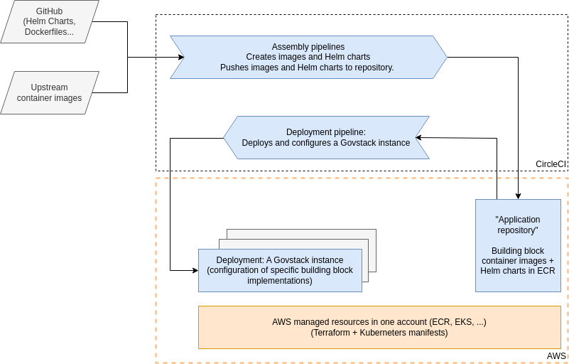

# Infrastructure

The infrastructure component has the purpose to efficiently run and manage the upper stack components. It is designed in a way to lower the dependency on specific cloud providers. At the same time, the component is designed to easily be deployed and scaled.

## What do we use to <mark style="background-color:blue;">build</mark> it?

<table><thead><tr><th width="201">Name</th><th>Purpose</th></tr></thead><tbody><tr><td>Terraform</td><td>Infrastracture-as-code tool</td></tr><tr><td>Terragrunt</td><td>Terraform Wrapper</td></tr><tr><td>AWS EKS</td><td>Managed Kubernetes Service</td></tr><tr><td>AWS ECR</td><td>Container Registry Service</td></tr></tbody></table>

## Where do we <mark style="background-color:blue;">demo</mark> it?

In all use case demos (except the DIY-Version), the same build is being used.

<table><thead><tr><th width="498">Github Repository</th><th>Used in...</th></tr></thead><tbody><tr><td><a href="https://github.com/GovStackWorkingGroup/sandbox-infra">Sandbox Infrastructure</a></td><td><a href="../access-demos/usct-use-case.md">Unconditional Social Cash Transfer (USCT) Demo</a></td></tr></tbody></table>

## Which <mark style="background-color:blue;">conceptual decisions</mark> do we follow?

The Sandbox Infrastructure provides the foundation of the Sandbox — an environment for deploying and running compatible building block implementations.

The main reason for using Kubernetes is to have a useful abstraction of networking and compute resources to build upon, so that compatible building block applications can remain portable. In some sense, the Sandbox Kubernetes cluster simulates a "miniature Internet": Pods are hosts, services running on the "hosts" have names (leveraging the cluster-internal DNS service) and communicate using the same protocols as in the Internet.

Naturally the abstraction is leaky, and it is good to keep in mind that in a real-world implementation the building block applications would be separated and isolated into different environments, which might not even be a Kubernetes cluster. However, a goal of the Sandbox is to make it reasonably easy an efficient to deploy a set of building blocks and start exploring and developing. Therefore, we developed and provide scripting to easily setup new Kubernetes cluster. It focuses on the building blocks and does not try to be a full production environment.

The reference implementation leverages AWS Elastic Kubernetes Service (EKS). More information about the implementation, which uses Terraform and Terragrunt to automate the setup, is available in [the Sandbox infrastructure repository](https://github.com/GovStackWorkingGroup/sandbox-infra).

### Two approaches for deployment:

* The building block deployment is self-contained and deployed inside the Sandbox (preferred for keeping the "safe and isolated environment" property, but not always possible).
* The building block implementation provides a gateway component that is deployed inside the Sandbox. The gateway provides s GovStack-compliant API and transparently accesses the externally deployed application (details out of scope).

### Building block packaging guidelines for Sandbox deployment

* Building block applications should be provided as one or more OCI compliant container images ("Docker images") and packaged using a Helm (version 3) chart that defines the resources required by the application.
  * For example, if the application uses a database, the deployment should define one.
* The chart should define a minimal, small scale deployment for exploration and development, covering only the essential components and functionality.
* The deployment should only depend on basic Kubernetes concepts and abstractions (e.g. deployments, pods, config maps, secrets, services, persistent volume claims).
* The application should be isolated into a Kubernetes namespace. The namespace name should be configurable during the chart install time.
* An application can not expect control of the cluster, and should not depend on advanced features like custom Kubernetes controllers.
* The application should not expose any interfaces by default (e.g. ingresses should be opt-in or disabled).
* The application should not, in general, require access to external resources in the Internet, but it can use other building blocks deployed in the same Sandbox.
* _Configurable_: The deployment should include means for providing initial configuration for the application. For example, the application can provide additional configuration APIs, read configuration provided via a ConfigMap at deployment time, or the configuration can be (partially) baked in to the container images. The exact mechanism is implementation specific, but should be scriptable (not require manual steps or using an UI).
* _Automatic deployment_: The deployment should be fully automated so that the deployment can be triggered e.g. from a CI/CD pipeline. Installing the chart with possible additional deployment-time configuration should start the application in a known, working state.
  * Preferably, the deployment should include basic tests that can be used to verify a successful deployment, and it should be possible to integrate the tests to the pipeline.

## Further documentation

<table data-view="cards"><thead><tr><th></th><th></th><th></th><th data-hidden data-card-cover data-type="files"></th><th data-hidden data-card-target data-type="content-ref"></th></tr></thead><tbody><tr><td><strong>Infrastructure Repository</strong></td><td>Documentation of the sandbox infrastructure component</td><td></td><td><a href="../.gitbook/assets/github-6980894_640.png">github-6980894_640.png</a></td><td><a href="https://github.com/GovStackWorkingGroup/sandbox-infra/blob/main/docs/1-main.md">https://github.com/GovStackWorkingGroup/sandbox-infra/blob/main/docs/1-main.md</a></td></tr><tr><td></td><td></td><td></td><td></td><td></td></tr><tr><td></td><td></td><td></td><td></td><td></td></tr></tbody></table>
