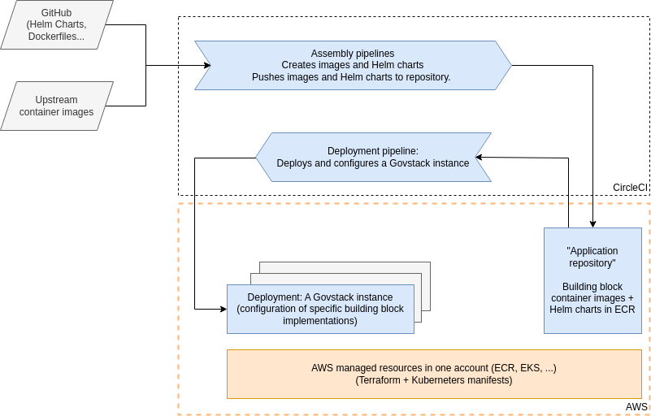

# Infrastructure

The Sandbox Infrastructure provides the foundation of the Sandbox — an environment for deploying and running compatible
building block implementations.

The main reason for using Kubernetes is to have a useful abstraction of networking and compute resources to build upon,
so that compatible building block applications can remain portable (see also the [DevOps chapter](devops.md)). In some
sense, the Sandbox Kubernetes cluster simulates a "miniature Internet": Pods are hosts, services running on the "hosts"
have names (leveraging the cluster-internal DNS service) and communicate using the same protocols as in the Internet. 

Naturally the abstraction is leaky, and it is good to keep in mind that in a real-world implementation the building
block applications would be separated and isolated into different environments, which might not even be a Kubernetes
cluster. However, a goal of the Sandbox is to make it reasonably easy an efficient to deploy a set of building blocks
and start exploring and developing. It focuses on the building blocks and does not try to be a full production
environment.

The reference implementation leverages AWS Elastic Kubernetes Service (EKS). More information about the implementation,
which uses Terraform and Terragrunt to automate the setup, is available in [the Sandbox infrastructure
repository](https://github.com/GovStackWorkingGroup/sandbox-infra).

