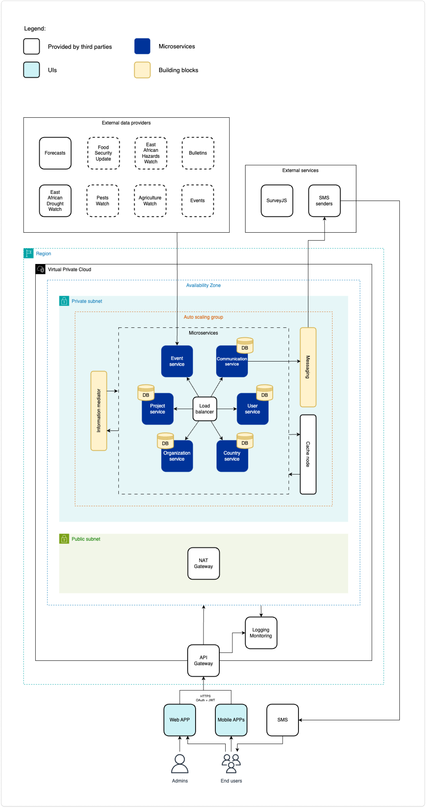

# Our Design Approach

## Designing along the GovStack specifications

Work on the use cases envisioned for the GovStack Sandbox was done in close coordination with the respective working groups along the [Implementation framework](https://govstack.gitbook.io/implementation-playbook/) and [UX/UI specifications](https://govstack.gitbook.io/bb-ux/).&#x20;

The goal was to build tangible and usable demos that provide a realistic but generalized representation of the use case and to support the implementing country and validate the Govstack specifications.

For the application in the sandbox, the use case in the process was generalized where possible. The procedure can be roughly divided into the following phases:

* Research
  * Receiving country- and use case specific input (i.e. as-is user journey, to-be user journey)
  * Conduct market research and validate market against received input
* Design
  * Design country-independent and country-specific Service Blueprints
  * Review Blueprint with Stakeholders
  * Design Wireframes
* Test
  * Develop prototype
  * Test prototype with users
  * Iterate wireframes
* Develop and provide findings
  * Share deliverables and findings with implementing country
  * Development of country-independent use case demo

<figure><figcaption></figcaption></figure>
