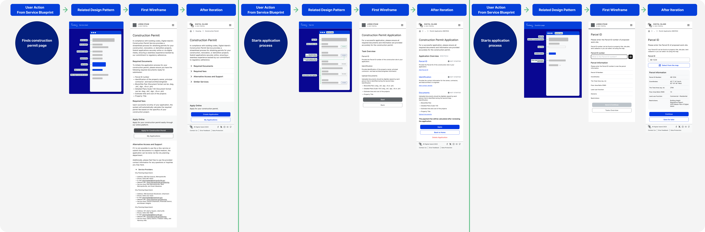

# Phase 2: Design

The design phase of the GovStack Sandbox project is where the analyses, conceptual ideas and research findings are transformed into practical design solutions. This phase encompasses two crucial steps to create user-friendly and effective interfaces while understanding the coordination within the service. These steps are:

1. **Design country-independent and country-specific Service Blueprints**: Detailed Service Blueprints were created, encompassing both country-independent and country-specific aspects. These blueprints served as a visual representation of the entire process, highlighting key interactions.
2. **Design Wireframes:** We developed wireframes to outline the user interface and interaction flow, serving as a base for the visual and functional aspects of the solution.

## Design Country-independent and country-specific Service Blueprints

Service Blueprints are a continuum of “to-be” journeys which are a series of diagrams that visualize the relationship between different components such as user action/goals, Building Blocks, and Data Input/output.

Detailed Service Blueprints were created, encompassing both country-independent and country-specific aspects. These blueprints served as a visual representation of the entire process, highlighting key interactions. There are two service blueprint created for this work:

* Djibouti - Construction Permit Use Case Service Blueprint
* Sandbox - Construction Permit Use Case Service Blueprint

What is Service Blueprint

A service blueprint is a diagram that visualizes the relationships between different service components — people, props (physical or digital evidence), and processes — that are directly tied to touchpoints in a specific customer journey.

More Information:\
[Service Blueprints: Definitions](https://www.nngroup.com/articles/service-blueprints-definition/)

<strong>Why we recommend using Service Blueprints</strong>

Blueprinting is most useful when coordinating complex services because it bridges cross-team efforts to make everyone familiar with the use case early on and enable preparation work

Service blueprints are companions to user journeys. They help organizations see the big picture of how a service is implemented and used. They pinpoint dependencies between user journeys of the service providers/government entities and users in the same visualization. They are instrumental in identifying and optimizing complex interactions, ultimately saving money for the organization and improving the experience for its users.

<strong>Our Service Blueprint Template</strong>

Our Service Blueprint Template was created for producing service blueprints based on GovStack Implementation Playbook and facilitating coordination between teams and components while producing deep understanding related to use cases that are worked on. They are a continuum of the “to-be” user journeys within the implementation playbook.

The primary elements of our service blueprints are:

* Processes
* Different service users and entities involved in providing the service
* Actions and goals of entities and users
* GovStack Design Patterns
* Required documents, Data input and output
* Building Blocks

<mark style="color:red;">Figma Link of the Template</mark>

**Djibouti - Construction Permit Use Case Service Blueprint:**

The first service blueprint was created for Djibouti - A construction permit use case as a primary reference point for our design. The service blueprint is directly derived from “Djibouti Construction Permit User Case- To be Journey” while using our service blueprint template which is specifically designed as a tool for implementation playbook.

* **Clarity and Understanding:** The service blueprint provided a clear and detailed visualization of the entire service process, including the interactions, different components, their relation and processes involved. This helped teams and stakeholders better understand how the service works and how it impacts its possible users.
* **Identifying the Pain Points:** By mapping out the service in detail, we identified the pain points and bottlenecks in the user journey. This allowed us to pinpoint areas that need improvement and focus our efforts on enhancing the experience.
* **Cross-functional Collaboration:** Service blueprints encouraged cross-functional collaboration and communication, as it required input and insights from various stakeholders.
* **Risk Assessment:** The service blueprint helped us to identify potential risks and challenges in the service delivery process. This allows you to develop mitigation strategies and contingency plans.
* **Alignment regarding Scope:** By creating a service blueprint based on the "to-be" journey, we ensure that the service aligns with the organization's strategic goals and objectives. This with risk assessment was a huge help in creating scope.
* **Mapping the GovStack Design Patterns (Link to design patterns Gitbook):** By incorporating the GovStack design patterns onto the service blueprint, we were able to create a comprehensive visualization of the service's interface flow, meticulously aligning it with user actions. This strategic addition proved to be exceptionally valuable as it facilitated a seamless transition into subsequent project phases, ensuring a harmonious and user-centric service design.

<figure><figcaption>
Djibouti - Construction Permit Service Blueprint
</figcaption></figure>

<mark style="color:red;">**(Figma Link)**</mark>&#x20;

**Sandbox - Construction Permit Use Case Service Blueprint:**

“Sandbox - Construction Permit Use Case Service Blueprint” created upon valuable insights gained from Djibouti construction permit use case and drawing from the insights gained during our research phase. This blueprint serves as an essential guide to navigating the complexities of the Sandbox Construction Permit Use Case service. This service blueprint:

* Showcases the dynamic interactions within the service, component relationships, and underlying processes that collectively define this service such as building blocks and design patterns.
* Allow us to gain early insights into potential risks and challenges, enabling us to proactively develop strategies and contingency plans. This ensures the resilience and reliability of the service.
* Creates an environment for seamlessly integrating GovStack design patterns into the blueprint, strategically aligning interface flow with possible user actions.
* Encourages cross-functional collaboration and open channels of communication. It leverages the expertise and insights of diverse stakeholders, enriching the design process with a variety of perspectives.
* Empowers stakeholders to gain a deep understanding of how the service functions and its complex relationship within different components.
* Allows us to zoom in on potential enhancements, identifying areas where the service can be further improved to ensure seamless user experiences and operational efficiency.
* Most importantly creates the foundational base for our design work and further phases.

<figure><figcaption>
Sandbox - Construction Permit Service Blueprint
</figcaption></figure>

<mark style="color:red;">**(Figma Link)**</mark>&#x20;

## Design Wireframes

#### **Design Wireframes:** 

Our wireframing process for the Sandbox - Construction Permit Use Case is grounded in a multi-faceted approach that combines **GovStack UX/UI specifications **<mark style="color:red;">**(Add Link)**</mark>, **service blueprint insights**, and the integration of **GovStack design patterns.** This methodology streamlines our design efforts, making the wireframing process more efficient and effective.

Our service blueprints with Govstack Design patterns act as the primary guide in the wireframing phase. They provide a holistic view of the service, helping us identify key touchpoints/interactions, allow us to leverage established UI/UX best practices and maintaining consistency across GovStack components. This influence ensures that the wireframes align seamlessly with the service's intended functionality and user journey.

<figure><figcaption>
User Actions and Design Patterns (from Service Blueprint)
</figcaption></figure>

<figure><figcaption>
From Service Blueprint to Design - Example
</figcaption></figure>

At the core of our wireframing process is a dedication to user-centric design. We begin by delving into a deep understanding of the needs, preferences, and challenges faced by our end-users. By placing the user experience at the forefront, we craft wireframes that prioritize usability and intuitive interaction.

While creating wireframes, we used **Figma** as our primary tool and started with creating a **style guide** and **component library** for UI elements in our design. For the component library, first, we used existing UI wireframing kits and changed them based on our case. We leverage component library functionality to construct a comprehensive library of reusable UI components for creating consistent designs and reducing the risk of design fragmentation.

In addition, our wireframes are built with a **mobile-first** mentality, ensuring that the user interface is optimized for mobile devices. This approach not only enhances the user experience on mobile devices but also serves as the foundation for responsive design.

As we progress through the wireframing phase, our ultimate objective is to deliver a user-friendly and efficient user interface for the Sandbox - Construction Permit Use Case. These wireframes serve as the foundation for subsequent development and testing phases, guaranteeing that the final product not only meets GovStack standards but also provides an exceptional user experience.

It is important to mention that this is an iterative process where user testing and feedback play a crucial role. Based on the user testing and feedback we constantly changed our wireframes to provide optimum solutions within our use case.

<mark style="color:red;">**(Figma Link) And Image**</mark>
