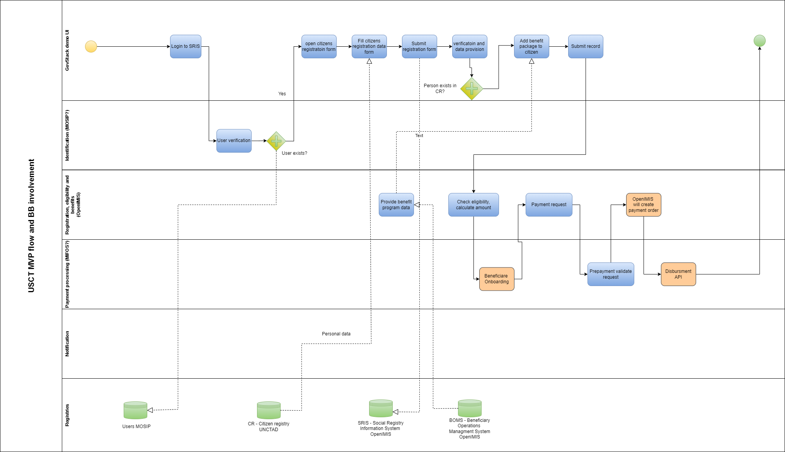

# Minimum Viable Product (MVP) eg. Happy Flow

Following page will cover USCT  (Unconditional Social Cash Transfer) minimum “Happy” flow and BB involvement in it. Minimum requirements from USCT MVP workflow perspective.

USCT description: [Digital Impact Exchange](https://solutions.dial.community/use_cases/unconditional_social_cash_transf) 

**MVP eg “Happy flow” will cover only very minimum part of USCT workflow and will use only some fragments from BB functionality, there will be no errors, corner cases and non-compliances.** 

**In “Happy flow”, Civil servant will only perform few steps in our UI:**

**Pre steps** before the Happy flow starts:

* CR and IFMS registries created using UNCTAD functionality (see [Registries](https://govstack-global.atlassian.net/wiki/spaces/DEMO/pages/179208267/Registries))
* User for SRIS/BOMS (OpenIMIS) created using MOSIP functionality (see  [Identity and verification](https://govstack-global.atlassian.net/wiki/spaces/DEMO/pages/179896365/Identity+and+verification))

**Happy flow:**

* Login to the SRIS - user will be verified (see [Identity and verification](https://govstack-global.atlassian.net/wiki/spaces/DEMO/pages/179896365/Identity+and+verification) )
* Register citizen to SRIS (OpenIMIS) - when entering citizens personal ID, citizens personal data will be pulled over x-road and personal data fields filled automatically with mocked data in CR Citizen Registry (UNCTAD) (see [Registration](https://govstack-global.atlassian.net/wiki/spaces/DEMO/pages/179601480/Registration) ) 
* Link benefit program to citizen - list of mocked programs is provided (OpenIMIS) (see  [Registration](https://govstack-global.atlassian.net/wiki/spaces/DEMO/pages/179601480/Registration) )
* Add additional benefit related information (payment due date, payment amount, account no …) to the BOMS form (OpenIMIS) (see  [Registration](https://govstack-global.atlassian.net/wiki/spaces/DEMO/pages/179601480/Registration) )
* Submit benefit package to the citizen - payment request triggered from OpenIMIS, which is background functionality
* Check if the payment due date is reached, trigger the benefit payment to the citizen by MIFOS functionality - this is the backround functionality, the verification of banc account is triggered towards IFMS mocked database (see [Payments](https://govstack-global.atlassian.net/wiki/spaces/DEMO/pages/179568721/Payments) )
* Notification of payment completed sent to the BOMS and Citizen - backround functionality will be mocked
  
 
**Out of the scope**: ConsentBB, WorkflowBB, MessagingBB, ScedulerBB.

**Note**: There are no adapters used to data and protocol translation (OpenIMIS uses FIHR protocol ) therefore workaround to build the API is done

## High level overview of BB in USCT “Happy flow” 

## Prerequisite registries
All registries, presented in Happy Flow diagram should be deployed and preconfigured (data input) for running the Happy Flow scenario.  

Before connecting all BB and running the flow, pre-required registries must be in place and users for Social system must be created to access the system:
* Users

* * User unique ID
* * Name
* * Last name
* * Role
* * Region (address)
* * District (address)

* CR- Citizen registry
* * UID - system ID generated by MOSIP
* * ID (personal ID)
* * First name
* * Last name
* * Birth Date
* * Gender
* * Region
* * District
* * Municipality
* * Village

* BOMS
* * benefit programs list (to choose)
* * eligibility criteria (positive response)

* IFMS - Integrated Finance Management Information System
* * Personal ID (Citizen)
* * Bank Account

## Implementation
Driver application building block is responsible to implement happy flow functionality.
Backend will call in order next building blocks APIs:
1. ID/MOSIP (optional)
2. UNCTAD
3. OpenIMIS
4. Payment