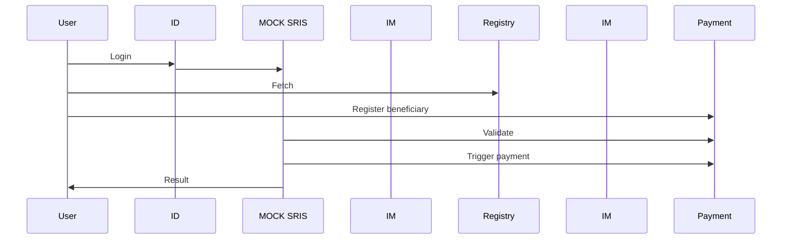

# Backend logic
## Prerequisite for the  Happy Flow

>Created registries & data in it:
>   * Civil Registry (created by Registry BB - Unctad)
>   * Social registry (for benefit program enrollment)
      >     * Created social program + criteria for enrollment
>     * Created application for applying under USCT
>   * Created Civil servant -user with credentials (ID-BB Mock application)
>   * Configured infrastructure (cloud + network +tokens installed+ services available+ BB-s configured)
>   * ...
>   *

**MVP eg “Happy flow” will cover only very minimum part of USCT workflow and will use only some fragments from BB functionality, there will be no errors, corner cases and non-compliances.**

## Civil servant
[Civil servant](../terminology-abbreviations.md#civil-servant) will perform next steps:


<details>
<summary>Pre steps</summary>

1. CR and IFMS registries created using UNCTAD functionality (see [Registries](https://govstack-global.atlassian.net/wiki/spaces/DEMO/pages/179208267/Registries))
2. User for SRIS/BOMS (OpenIMIS) created using MOSIP functionality (see  [Identity and verification](https://govstack-global.atlassian.net/wiki/spaces/DEMO/pages/179896365/Identity+and+verification))

</details>

### created citizen registry


### Fetch citizen data from the ID BB
Personal ID is a param to fetch data.
MOSIP is responsible to provide data ([Foundational ID](../terminology-abbreviations.md#foundational-id-system)).
```json
{
  "requestTime": "<string>",
  "request": {
    "individualId": "<string>",
    "pin": "<string>",
    "fullName": [ //1
      {
        "language": "<string>",
        "value": "<string>"
      },
      {
        "language": "<string>",
        "value": "<string>"
      }
    ],
    "gender": [
      {
        "language": "<string>",
        "value": "<string>"
      },
      {
        "language": "<string>",
        "value": "<string>"
      }
    ],
    "dateOfBirth": "<string>",
    "streetAddress": [
      {
        "language": "<string>",
        "value": "<string>"
      },
      {
        "language": "<string>",
        "value": "<string>"
      }
    ],
    "locality": [
      {
        "language": "<string>",
        "value": "<string>"
      },
      {
        "language": "<string>",
        "value": "<string>"
      }
    ],
    "region": [
      {
        "language": "<string>",
        "value": "<string>"
      },
      {
        "language": "<string>",
        "value": "<string>"
      }
    ],
    "postalCode": "<string>",
    "encodedPhoto": "<string>",
    "email": "<string>",
    "phone": "<string>",
    "country": [
      {
        "language": "<string>",
        "value": "<string>"
      },
      {
        "language": "<string>",
        "value": "<string>"
      }
    ],
    "individualBiometrics": {
      "format": "<string>",
      "version": "<integer>",
      "value": "<string>"
    }
  }
}
```
1. Full name should be split. First, Middle, Surname...

### Fetch citizen data from the registry BB
Personal data fetch from created [citizen registry data](main.md#created-citizen-registry) through Foundational ID from MOSIP.

### Merging
[Related API specification](https://govstack.gitbook.io/bb-registration/v/registration-1.0/7-service-apis#eforms-eformid)

Merging data from ID and Registry BBs.

functionally data from registry via personal ID


Entering citizens personal ID into the E-Form. (E-Form created from trough UNCTAD solution otherwise
[Registration BB]()) citizens personal data will be pulled and personal data fields filled automatically
with mocked data in CR Citizen Registry (UNCTAD)
(see [Registration](https://govstack-global.atlassian.net/wiki/spaces/DEMO/pages/179601480/Registration) )


```json
{
  "eFormId": "d98a205a-679b-485b-823d-7a32a391e744",
  "name": "A1",
  "description": "string",
  "version": "1",
  "latest": true,
  "schema": {
    "additionalProp1": {
      "FoundationalID": "",
      "PersonalID": ""
      }
    }
  }

```
1. No biometric data
2. No language data


### Link/choose benefit program to citizen
list of mocked programs is provided (OpenIMIS) (see  [Registration](https://govstack-global.atlassian.net/wiki/spaces/DEMO/pages/179601480/Registration) )

It should come from https://oleksii-1.gitbook.io/open-imis/2-api#provide-benefit-program-details-product-details  
Provide Benefit program details (Product details) endpoint in OpenIMIS

### Registration
Add additional benefit related information (payment due date, payment amount, account no …) to the BOMS form (OpenIMIS) (see  [Registration](https://govstack-global.atlassian.net/wiki/spaces/DEMO/pages/179601480/Registration) )
It will be performed through Sandbox provided UI

#### Prerequisites
[API specification](https://govstack.gitbook.io/bb-registration/v/registration-1.0/7-service-apis#8.1-online-registration-e-services)

#### Eligibility and enrollment decisions
Need to find related API specification.

#### Determination of benefits and service package
Need to find related API specification.

### Submit benefit package to the citizen
Payment request triggered from OpenIMIS, which is background functionality.

Fill registration [form](https://govstack.gitbook.io/bb-registration/v/registration-1.0/7-service-apis#8.1-online-registration-e-services).

[Submit registration form](https://oleksii-1.gitbook.io/open-imis/2-api#request-beneficiary-enrollment) to OpenIMIS

### Payment
Check if the payment due date is reached, trigger the benefit payment to the citizen by MIFOS functionality - this is the backround functionality, the verification of banc account is triggered towards IFMS mocked database (see [Payments](https://govstack-global.atlassian.net/wiki/spaces/DEMO/pages/179568721/Payments) )

#### Beneficiary onboarding
[API specification](https://govstack.gitbook.io/bb-payments/v/payments-1.0/9-service-apis#8.2.1-beneficiary-onboarding-api)

```json

{
  "RequestID": "system data", // 1
  "SourceBBID": "system data", // 2
  "Beneficiaries": [
    {
      "PayeeFunctionalID": "string", //3
      "PaymentModality": "string", //4
      "FinancialAddress": "string" //5 
    }
  ]
}
```
1. Globally unique ID which is coming from [driver app](main.md#implementation).
2. ID which is coming from [driver app](main.md#implementation) to identify the origination of the request.
3. ID of the beneficiary.
4. Type of payment e.g. (Bank account, Mobile money...)
5. Financial address of the recipient of the cash transfer.

#### Prepayment validation
[API specification](https://govstack.gitbook.io/bb-payments/v/payments-1.0/9-service-apis#8.2.2-pre-payment-validation-api)

```json
{
  "RequestID": "string", //1
  "SourceBBID": "string", //2
  "BatchID": "string", //3
  "CreditInstructions": [
    {
      "InstructionID": "string", //4 
      "PayeeFunctionalID": "string",//5
      "Amount": 0, //6
      "Currency": "string", // 7
      "Narration": "string" // 8
    }
  ]
}
```
1. Globally unique ID which is coming from [driver app](main.md#implementation).
2. ID which is coming from [Information Mediator](https://github.com/GovStackWorkingGroup/sandbox-bb-information-mediator) to identify the origination of the request.
3. BatchID for batch submitted by the Source BB.
4. Individual ID for each instruction in the Credit Batch.
5. The functional ID of the beneficiary.
6. Amount to be Credited.
7. Transaction Currency Code.
8. Description of Payment.

#### Bulk disbursement
[API specification](https://govstack.gitbook.io/bb-payments/v/payments-1.0/9-service-apis#8.2.2-bulk-disbursement-apis)

```json
{
  "RequestID": "string", //1
  "SourceBBID": "string", //2
  "BatchID": "string", //3
  "CreditInstructions": [
    {
      "InstructionID": "string", //4
      "PayeeFunctionalID": "string", //5
      "Amount": 0, //6
      "Currency": "string", //7
      "Narration": "string" //8
    }
  ]
}
```
1. Globally unique ID which is coming from [driver app](main.md#implementation).
2. ID which is coming from [Information Mediator](https://github.com/GovStackWorkingGroup/sandbox-bb-information-mediator) to identify the origination of the request.
3. BatchID for batch submitted by the Source BB.
4. Individual ID for each instruction in the Credit Batch
5. The functional ID of the beneficiary.
6. Amount to be Credited
7. Transaction Currency Code
8. Description of Payment

### Notification
Payment completed sent to the BOMS and Citizen - backround functionality will be mocked




## Implementation
Driver application building block is responsible to implement happy flow functionality.
Backend will call in order next building blocks APIs:
1. ID/MOSIP (optional)
2. OpenIMIS
3. Payment
4. Information Mediator