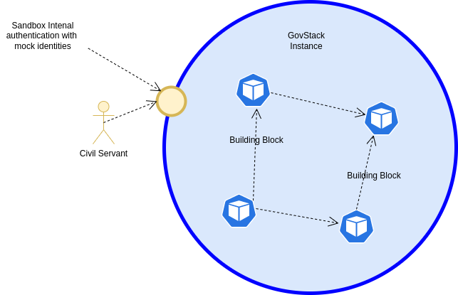

# Minimum Viable Product (MVP) eg. Happy Flow

## Overview
The USCT MVP is built based upon the technical sandbox and the USCT simulation. It’s intended to enable a vertical
penetration (re-define vertical penetration) of GovStack based on a slice of the journey of the use case "Unconditional
Social Cash Transfer" in order to make a common exemplary journey accessible to all teams and groups. **It is a technical
proof of concept and example implementation for the GovStack community.**

USCT description: [Digital Impact Exchange](https://solutions.dial.community/use_cases/unconditional_social_cash_transf) 

## Steps
Steps are cover only minimum part of workflow and will use only some fragments from BB functionality, there will be
no errors, corner cases and non-compliances, mocked authentication.

For more details please take a look [backend logic](backend.md).
